# 第 1 章：存储金字塔与数据搬运 (The Memory Hierarchy)

> **"Data movement is the enemy."**  
> —— Bill Dally (NVIDIA Chief Scientist)

对于习惯了数学推导的你来说，计算机世界往往被抽象为一个图灵机：拥有无限的纸带（内存），每一步读写操作的代价是 $O(1)$。在算法课上，我们只关心计算复杂度（Time Complexity），比如矩阵乘法是 $O(N^3)$。

然而，在物理世界中，**“读取数据”和“计算数据”的代价有着天壤之别**。

想象一下：
- **CPU 寄存器** 是你的大脑，运算极快，但只能记住几个数字。
- **L1/L2 缓存** 是你的办公桌，伸手就能拿到数据，但空间有限。
- **内存 (DRAM)** 是隔壁房间的书架，去拿一次书需要几分钟。
- **硬盘 (SSD/HDD)** 是几公里外的图书馆，去取一次书需要几天甚至几周。

对于大模型训练而言，**性能瓶颈往往不在于你算得有多快，而在于你搬运数据的速度有多慢**。这就是为什么你的 GPU 利用率总是忽高忽低，为什么 Transformer 的优化几乎全部围绕着“减少显存读写”展开。

本章将带你从物理视角重新审视计算机，理解为什么 **Memory Wall (内存墙)** 是 AI 时代的最大挑战。

---

## 1.1 从 SRAM 到 HDD：速度与容量的权衡

计算机存储系统是一个严格的金字塔结构。越靠近 CPU/GPU 核心的存储器，速度越快，但造价越昂贵，容量也越小。

### 1.1.1 存储金字塔 (The Memory Hierarchy Pyramid)

我们可以用一个数量级图表来直观感受这种巨大的差异（时间单位归一化为“CPU 周期”或人类可感知的“秒”）：

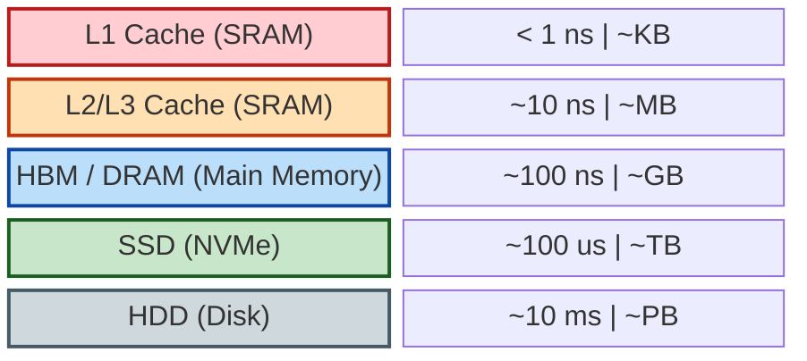

**关键洞察：**

1.  **L1/L2/L3 Cache (SRAM)**:
    -   **物理本质**：静态随机存取存储器 (Static RAM)。由 6 个晶体管 (Transistors) 存储 1 bit，速度极快，不需要刷新。
    -   **命中率 (Hit Rate)**：如果 CPU 需要的数据在 Cache 里，只需 ~1-4 个时钟周期。如果不在 (Cache Miss)，CPU 就必须停下来等待几百个周期去内存取。
    -   **AI 启示**：矩阵乘法之所以要做 Tiling (分块)，就是为了让切分后的小矩阵能塞进 L1/L2 Cache，从而复用数据，避免反复去读慢速内存。

2.  **DRAM (Dynamic RAM) & HBM (High Bandwidth Memory)**:
    -   **物理本质**：由 1 个电容和 1 个晶体管组成。电容会漏电，所以每隔几毫秒必须“刷新”一次（这就是“动态”的由来）。
    -   **带宽 (Bandwidth)**：这是大模型的命门。
        -   普通 DDR4/DDR5 内存带宽：~50-100 GB/s。
        -   **HBM (高带宽内存)**：NVIDIA A100/H100 显卡专用的内存。它通过 TSV (硅通孔) 技术把多个 DRAM 芯片垂直堆叠起来，像盖楼一样。
        -   **H100 的 HBM3 带宽**：高达 **3.35 TB/s**！是普通内存的 30-60 倍。
    -   **为什么显卡那么贵？** HBM 的良率低、工艺复杂，占据了高端 GPU 成本的很大一部分。

3.  **SSD/HDD**:
    -   虽然 SSD 很快，但对比内存依然是蜗牛。在训练大模型时，我们尽量避免在训练过程中频繁读写磁盘（除非是 DataLoader 的预取阶段）。

### 1.1.2 延迟 (Latency) vs 带宽 (Bandwidth)

这是两个经常被混淆的概念。

*   **延迟 (Latency)**：从发出请求到收到第一个字节的时间。（水管有多长）
*   **带宽 (Bandwidth)**：单位时间内能传输的数据量。（水管有多粗）

**比喻**：
*   **低延迟**：法拉利跑车送 U 盘。响应快，但一次送的数据少。
*   **高带宽**：装满硬盘的卡车在高速公路上跑。启动慢（延迟高），但一旦跑起来，吞吐量惊人。

**GPU 是吞吐量怪兽 (Throughput Oriented)**，它容忍高延迟，但极其依赖高带宽。为了掩盖内存的高延迟，GPU 会同时运行成千上万个线程——当一部分线程在等内存数据时，另一部分线程利用 ALU (算术逻辑单元) 进行计算。

---

## 1.2 数据搬运的代价

在冯·诺依曼架构中，计算单元 (CPU/GPU Core) 和存储单元 (Memory) 是分离的。数据必须通过总线 (Bus) 在两者之间搬运。

### 1.2.1 冯·诺依曼瓶颈 (Von Neumann Bottleneck)

现代处理器的计算能力增长速度，远远超过了内存带宽的增长速度。

> **科普：什么是 TFLOPS？**
>
> 在阅读显卡参数时，你经常会看到这个词。它是衡量计算机算力最核心的指标。
> *   **FLOPS** (Floating Point Operations Per Second)：每秒浮点运算次数。
> *   **GFLOPS** (Giga) = $10^9$ 次/秒 (十亿)
> *   **TFLOPS** (Tera) = $10^{12}$ 次/秒 (万亿) —— 目前主流 GPU 的量级。
> *   **PFLOPS** (Peta) = $10^{15}$ 次/秒 (千万亿) —— 超级计算机或 GPU 集群的量级。
>
> 当我们说 "H100 有 1000 TFLOPS 算力" 时，意味着它每秒钟能做 **一千万亿次** 乘法或加法运算。这个数字非常恐怖，但前提是——**数据必须已经在它的寄存器里准备好了**。

*   **计算能力**：H100 FP16 算力 $\approx$ 1000 TFLOPS ($10^{15}$ ops/s)
*   **内存带宽**：H100 HBM3 带宽 $\approx$ 3.35 TB/s ($3.35 \times 10^{12}$ bytes/s)

这意味着：**GPU 每秒钟能进行的运算次数，是它能搬运的数据量的 300 倍以上！**

如果你写的算法（比如简单的向量加法 `C = A + B`）只做一次运算就需要读写一次内存，那么 GPU 的计算核心将有 99% 的时间在空转，等待数据从内存送达。这就是 **Memory-bound (带宽受限)**。

### 1.2.2 算术强度 (Arithmetic Intensity)

为了量化这个问题，我们引入 **算术强度 (Arithmetic Intensity)**，记为 $I$：

$$ I = \frac{\text{FLOPS (浮点运算次数)}}{\text{Bytes (内存读写字节数)}} $$

*   **单位**：FLOPs/Byte

**案例分析**：

1.  **向量加法 (Vector Add)**: $C = A + B$ (假设 $N$ 个 float16 元素)
    *   运算：$N$ 次加法。
    *   访存：读 $A$ ($2N$ bytes), 读 $B$ ($2N$ bytes), 写 $C$ ($2N$ bytes)。共 $6N$ bytes。
    *   $I = \frac{N}{6N} = 1/6$ FLOPs/Byte。
    *   **结论**：极低的算术强度，典型的 Memory-bound。

2.  **矩阵乘法 (Matrix Multiply)**: $C = A \times B$ ($N \times N$ 矩阵)
    *   运算：$2N^3$ 次 (乘加)。
    *   访存：读 $A$ ($N^2$), 读 $B$ ($N^2$), 写 $C$ ($N^2$)。共 $3N^2$ (假设 float32 为 4 bytes，则 $12N^2$)。
    *   $I \approx \frac{2N^3}{12N^2} = \frac{N}{6}$。
    *   **结论**：随着 $N$ 增大，算术强度线性增加！只要 $N$ 足够大，就是 Compute-bound。这就是为什么深度学习如此依赖矩阵乘法。

### 1.2.3 Roofline Model (屋顶模型)

这是性能分析中最著名的模型。它告诉我们要想达到硬件的峰值性能，算法需要满足什么条件。

$$ \text{Attainable Performance} = \min(\text{Peak Performance}, \text{Peak Bandwidth} \times \text{Arithmetic Intensity}) $$

我们可以用 Python 绘制一个简单的 Roofline Model 示意图（见下图）：

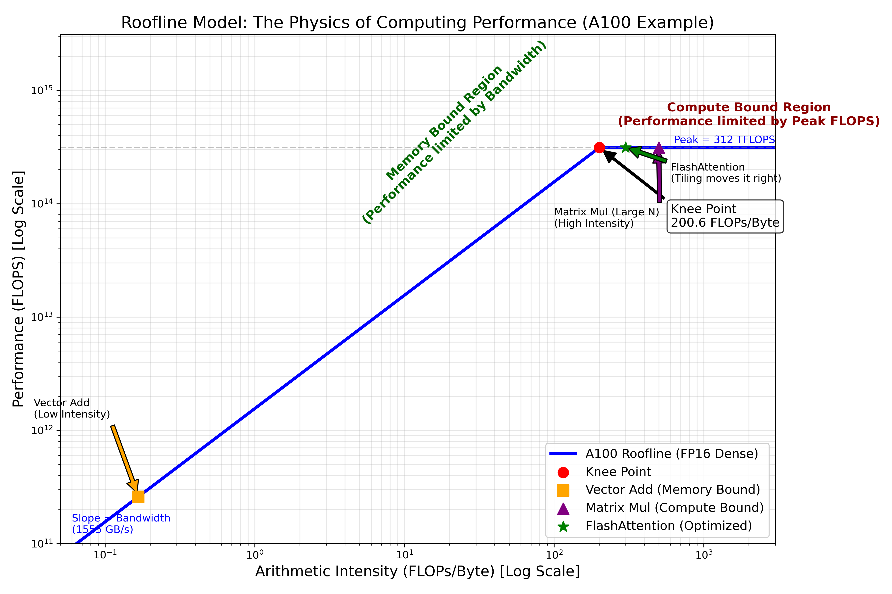

> **图解说明**：
> *   **横轴 (Arithmetic Intensity)**：计算密度，即每搬运 1 Byte 数据能做多少次浮点运算。
> *   **纵轴 (Performance)**：实际达到的算力 (GFLOPS)。
> *   **左侧斜坡区 (Memory-Bound)**：**带宽受限**。此时算力并未饱和，瓶颈在于数据搬运太慢。无论你增加多少计算核心，性能都不会提升，除非增加显存带宽。大多数简单的向量操作（如 Element-wise add）都在这里。
> *   **右侧平顶区 (Compute-Bound)**：**算力受限**。此时数据搬运已经跟上了，瓶颈在于计算单元（ALU）忙不过来。矩阵乘法（MatMul）、卷积（Conv）通常在这里。
> *   **拐点**：这是硬件的最佳工作点。为了达到峰值性能，你的算法必须提供足够的计算密度。

---

### 1.3 为什么 Attention 是 Memory-bound?

Transformer 的核心 Attention 机制：

$$ \text{Attention}(Q, K, V) = \text{softmax}(\frac{QK^T}{\sqrt{d_k}})V $$

在标准的实现中，我们需要计算 $S = QK^T$，得到一个 $N \times N$ 的矩阵（$N$ 是序列长度）。
然后对 $S$ 做 Softmax，再读写 $N \times N$ 的矩阵。

当 $N$ 很大时（长文本），$N \times N$ 的中间矩阵会变得巨大，导致频繁的 HBM 读写。
虽然矩阵乘法本身是 Compute-bound，但中间结果的 **读写 (IO)** 拖累了整体速度。

这就是 **FlashAttention** 诞生的背景：它通过 Tiling 技术，在 GPU 的 SRAM (L1/Shared Memory) 中一次性计算完 Softmax 的一部分，**坚决不把 $N \times N$ 的中间大矩阵写回 HBM**。

> **核心结论**：在 AI 系统优化中，**减少 HBM 访问次数** 往往比 **减少计算量** 更重要。

---

## 下一步

现在我们理解了数据搬运的物理代价。下一章，我们将深入 CPU 和 GPU 的内部，看看这些计算核心是如何利用流水线和并行机制来压榨每一分性能的。

---


# 第 2 章：计算核心与并行范式 (The Compute Engines)

> **"CPU is a latency beast; GPU is a throughput monster."**

如果说第一章我们讨论的是“仓库”（存储）和“运输队”（带宽），那么这一章我们将走进“工厂”内部，拆解那些真正干活的机器——CPU 和 GPU。

对于数学背景的同学来说，理解硬件最困难的地方在于：**硬件不是在做数学运算，而是在处理比特流**。为了让物理电路跑得更快，工程师们设计了极其复杂的控制逻辑（流水线、分支预测、超线程）。

理解这些机制，你就会明白：为什么写了 `for` 循环会慢？为什么 GPU 极其讨厌 `if-else`？

---

## 2.1 CPU：逻辑复杂的控制者

CPU (Central Processing Unit) 是计算机的“大管家”。它的设计目标是：**尽可能快地执行复杂的串行代码**。

### 2.1.1 流水线 (Pipeline) —— 为什么一条指令不是一步完成的？

在数学上，$a = b + c$ 是一步操作。但在 CPU 内部，这行代码被拆解成了多个微步骤，就像汽车装配线一样：

1.  **Fetch (取指)**：从内存取指令。
2.  **Decode (译码)**：翻译指令（这是加法？还是跳转？）。
3.  **Execute (执行)**：ALU 真正进行加法运算。
4.  **Write Back (写回)**：把结果存回寄存器。

**流水线的魔力**：
假设每个步骤需要 1ns。如果不流水线化，执行一条指令需要 4ns。
一旦流水线填满，虽然单条指令的延迟（Latency）还是 4ns，但平均每 1ns 就能产出一条结果！

> **代码启示**：数据依赖 (Data Dependency) 是流水线的杀手。
> 如果 `b = a + 1` 必须等 `a = 1 + 1` 算完，流水线就会**停顿 (Stall)**，性能瞬间暴跌。

### 2.1.2 分支预测 (Branch Prediction) —— CPU 的“赌博”机制

流水线最怕遇到什么？**分支跳转 (`if-else`)**。

当 CPU 遇到 `if (x > 0)` 时，它不知道下一条指令该去读 `True` 的分支还是 `False` 的分支。如果等算出 `x > 0` 的结果再取指，流水线就断了。

于是，CPU 会进行**分支预测**：根据历史记录，“猜”你会走哪条路，并提前把那条路上的指令塞进流水线执行。

*   **猜对了**：流水线满载运行，性能起飞。
*   **猜错了**：**Pipeline Flush**！刚才提前跑的所有指令全部作废，清空流水线，从正确的分支重新开始。代价极其昂贵（几十个时钟周期）。

> **Python 优化案例**：
> 在处理数组时，**先排序再遍历** 有时比直接遍历更快。为什么？
> 因为排序后的数据（如 `TTTTFFFF`）让分支预测器极其容易猜中（这就是著名的 StackOverflow 案例：*Why is processing a sorted array faster than processing an unsorted array?*）。

### 2.1.3 SIMD (Single Instruction, Multiple Data)

这是 CPU 并行计算的基础，也是向量化 (Vectorization) 的物理实现。

*   **标量模式**：`a[0] + b[0]`，`a[1] + b[1]`，`a[2] + b[2]`，`a[3] + b[3]`。做 4 次加法，发 4 条指令。
*   **SIMD 模式 (AVX/NEON)**：CPU 拥有超宽的寄存器（如 256-bit AVX2，能装 8 个 float32）。一条指令 `vaddps`，直接把 8 对数字同时相加。

**NumPy 的秘密**：当你写 `np.array([1,2]) + np.array([3,4])` 时，底层调用的就是 SIMD 指令。如果你写 Python `for` 循环，就是回到了低效的标量模式。

---

## 2.2 GPU：吞吐为王的暴力美学

GPU (Graphics Processing Unit) 的设计哲学与 CPU 截然不同。它不擅长复杂的逻辑控制（预测、乱序执行），而是**堆砌了成千上万个简单的计算核心**。

### 2.2.1 SIMT (Single Instruction, Multiple Threads)

这是 NVIDIA CUDA 编程模型的核心。

想象一下，你有一个连队（32 个士兵）。指挥官（控制单元）发出一声号令：“向前走一步！”（Instruction）。
于是，32 个士兵（Threads）**同时**迈出了腿。

这就是 **SIMT**：**单条指令，驱动多线程**。

*   **Grid / Block / Thread**：GPU 的线程层级结构。
*   **Warp (线程束)**：这是 GPU 调度的最小单位（通常是 32 个线程）。**这 32 个线程必须在同一时刻执行同一条指令**。

### 2.2.2 Warp Divergence (分支发散) —— GPU 的噩梦

既然 32 个线程必须执行同一条指令，那如果代码里写了 `if-else` 怎么办？

```python
if (thread_id < 16):
    do_A()
else:
    do_B()
```

在 CPU 上，线程 A 走 A 路，线程 B 走 B 路，互不干扰。
但在 GPU 的同一个 Warp 里：
1.  指挥官大喊：“执行 A！”
    *   前 16 个线程干活。
    *   **后 16 个线程必须发呆（Masked Off）**，等待 A 干完。
2.  指挥官大喊：“执行 B！”
    *   前 16 个线程发呆。
    *   后 16 个线程干活。

**结果**：总耗时 = A 的耗时 + B 的耗时。**硬件利用率直接腰斩一半！**

> **AI 启示**：这就是为什么神经网络算子（如 ReLU, MatMul, Conv）很少有复杂的逻辑判断，而是倾向于纯粹的数学运算。`Dropout` 使用的是数学掩码（乘 0），而不是 `if` 判断。

### 2.2.3 Tensor Core：为 AI 而生的核武器

普通的 CUDA Core 可以做任意运算（加减乘除、正弦余弦）。
但在深度学习中，99% 的计算量都是矩阵乘法 ($D = A \times B + C$)。

NVIDIA 从 Volta 架构（V100）开始引入了 **Tensor Core**：
它是一个专用的硬件电路，**在一个时钟周期内完成 $4 \times 4$ 矩阵乘加运算**。

*   **效率**：比普通 CUDA Core 快几倍甚至几十倍。
*   **代价**：必须满足特定的形状限制（如矩阵维度必须是 8 或 16 的倍数）和精度限制（通常是 FP16/BF16）。

这就是为什么我们在 PyTorch 中建议 `batch_size` 设为 8 的倍数，甚至最好是 2 的幂。

---

## 2.3 异构计算与 PCIe/NVLink

在 AI 服务器中，CPU 和 GPU 是协作关系。

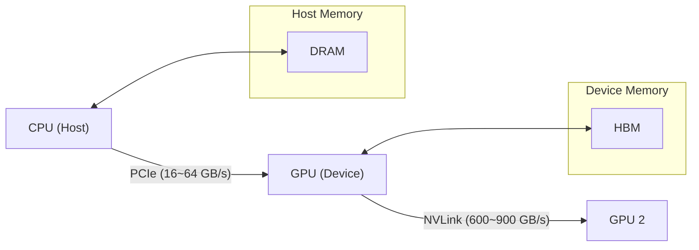

### 2.3.1 PCIe：细水管瓶颈

CPU 和 GPU 之间通过 **PCIe 总线** 连接。
*   **PCIe 4.0 x16**：带宽约 64 GB/s。
*   **对比 HBM**：GPU 内部显存带宽 2000+ GB/s。

**差距是 30 倍！**

> **工程陷阱**：
> 很多初学者写代码时，会在训练循环里频繁进行 `tensor.cpu()` 或 `tensor.item()` 操作。
> 这会导致数据在 CPU 和 GPU 之间反复通过 PCIe 细水管搬运，并且由于 Python 的同步机制，会强制 GPU 等待 CPU，导致训练速度极其缓慢。
>
> **原则**：**一旦数据上了 GPU，就别让它轻易下来。**

### 2.3.2 NVLink：多卡互联的基石

当一个模型大到单张卡放不下时，我们需要多张卡一起跑。
如果多张卡之间也走 PCIe 通信，速度会慢到无法接受。

**NVLink** 是 NVIDIA 专有的高速互联技术，让 GPU 之间可以直接通信，绕过 CPU 和 PCIe。
在 H100 上，NVLink 带宽高达 900 GB/s，几乎接近本地显存的速度。这使得 **8 张 GPU 看起来像是一个巨大的虚拟 GPU**，为训练万亿参数大模型提供了可能。

---

## 总结：如何写出“硬件友好”的代码？

1.  **CPU 是管家，GPU 是工人**：复杂的逻辑、数据预处理交给 CPU；繁重的、重复的矩阵运算交给 GPU。
2.  **避免 GPU 分支**：在 Shader/Kernel 代码中尽量少用 `if-else`，多用数学掩码。
3.  **喂饱 Tensor Core**：矩阵维度对齐到 8/16/32 的倍数，使用 FP16/BF16。
4.  **减少 PCIe 传输**：Batch 越大越好，减少 CPU/GPU 交互频率。

---

## 下一步

既然硬件只认识 0 和 1，那么数学上的实数（Real Number）在计算机里究竟是如何表示的？为什么 `0.1 + 0.2 != 0.3`？这种精度误差会不会毁了我们的模型训练？

下一章：**第 3 章：精度与数值的艺术**。


# 第 3 章：精度与数值的艺术 (Numerical Precision)

> **"God made the integers, all else is the work of man."** —— Leopold Kronecker

在数学世界里，实数轴是连续的、无限稠密的。但在计算机的硅基世界里，**“实数”是不存在的**。

计算机只有有限的比特（0 和 1）。当我们试图用有限的比特去模拟无限的实数时，必然会付出代价——这个代价就是**精度（Precision）**。

对于 AI 工程师来说，理解这个代价至关重要。为什么 BERT 模型用 FP16 训练会比 FP32 快一倍且显存减半？为什么 LLaMA 用 BF16 而不是 FP16？为什么 `0.1 + 0.2 != 0.3`？

这一章，我们将揭开浮点数的物理面纱。

---

## 3.1 浮点数陷阱：为什么计算机算不准？

### 3.1.1 科学计数法的二进制版本

在 IEEE 754 标准中，一个浮点数被存储为三部分：

$$
\text{Value} = (-1)^{\text{Sign}} \times (1 + \text{Mantissa}) \times 2^{\text{Exponent} - \text{Bias}}
$$

*   **符号位 (Sign)**：正还是负？
*   **指数位 (Exponent)**：决定了数值的**范围**（数量级）。存储的是 `真实指数 + Bias`。
    *   **Bias 的由来**：为了让指数能够表示负数（如 $2^{-3}$），IEEE 754 规定指数位采用**移码 (Offset Binary)** 表示。
    *   公式：$\text{Bias} = 2^{k-1} - 1$，其中 $k$ 是指数位的位数。
    *   例如 FP32 有 8 位指数，$\text{Bias} = 2^{8-1} - 1 = 127$。
*   **尾数位 (Mantissa)**：决定了数值的**精度**（有效数字）。

| 格式 | 总位数 | 符号位 | 指数位 (Range) | 尾数位 (Precision) | Bias |
| :--- | :---: | :---: | :---: | :---: | :---: |
| **FP32** | 32 | 1 | 8 | 23 | 127 |
| **FP16** | 16 | 1 | 5 | 10 | 15 |
| **BF16** | 16 | 1 | 8 | 7 | 127 |

> **计算示例 1：如何从机器码反推数值？(FP16)**
>
> 假设内存中有一个 FP16：`1 | 10010 | 1000000000`
>
> 1.  **符号位**：`1` $\rightarrow$ 负数。
> 2.  **指数位**：`10010` (十进制 18)。
>     *   真实指数 = $18 - 15 (\text{Bias}) = 3$。
> 3.  **尾数位**：`100...` (10位)。
>     *   补上隐含的 `1.` $\rightarrow$ $1.1$ (二进制)。
>     *   $1.1_2 = 1 + 2^{-1} = 1.5$ (十进制)。
> 4.  **最终计算**：
>     *   $\text{Value} = -1 \times 1.5 \times 2^3 = -1.5 \times 8 = -12.0$
>
> **计算示例 2：计算机如何表示 0.15625？(FP16)**
> 
> 1.  **科学计数法**：$0.15625 = 1.25 \times 2^{-3}$
> 2.  **符号位**：正数 $\rightarrow$ `0`
> 3.  **指数位**：
>     *   真实指数是 $-3$。
>     *   在 FP16 中，存储指数 = 真实指数 + Bias = $-3 + 15 = 12$。
>     *   $12$ 的二进制是 `01100`。
> 4.  **尾数位**：
>     *   $1.25$ 的二进制是 $1.01$。
>     *   去掉隐含的整数 `1`，剩下 `01`。
>     *   补齐 10 位：`0100000000`。
> 
> **最终机器码**：`0 | 01100 | 0100000000`

这就好比用一把尺子去测量宇宙：
*   **指数**决定了尺子有多长。
*   **尾数**决定了尺子上的刻度有多密。

### 3.1.2 浮点数的“稀疏”分布

初学者最容易忽视的是：**浮点数在数轴上的分布是不均匀的。**

*   **在 0 附近**：浮点数非常稠密，精度极高。
*   **在数值很大时**：浮点数变得非常稀疏，两个相邻可表示数之间的差距（Gap）会变得巨大。

为了直观理解，我们模拟了一个只有 6 bit 的微型浮点系统（Mini-Float），并画出了它能表示的所有数值：

> **Mini-Float 6-bit 定义**：
> *   **1 bit 符号位**
> *   **3 bit 指数位** (Bias = 3)
> *   **2 bit 尾数位**
> *   能表示的最大值：$1.75 \times 2^{(6-3)} = 1.75 \times 8 = 14$ (注意：指数全为1时通常保留给Inf/NaN)


> **图解说明**：
> *   蓝色的竖线代表计算机能“精确表示”的数字。
> *   红色的箭头标注了相邻两个数字之间的间隙 (Gap)。
> *   **关键观察**：随着数值变大（从 0.5 到 4.0），**蓝线变得越来越稀疏，间隙（Gap）成倍增加**。
> *   在 [0.25, 0.5] 区间，Gap 很小，精度很高。
> *   在 [2, 4] 区间，Gap 变大。这意味着：在这个区间内，任何计算结果如果落在了空隙里，都必须被强制“舍入”到最近的蓝线上。这就是**精度丢失**的物理来源。

**数学推论**：
浮点数的绝对误差（Absolute Error）与数值本身的大小成正比。也就是说，**数值越大，误差越大**。

这解释了一个经典现象：**大数吃小数**。
如果你尝试计算 `10000000.0 + 0.0000001`，在 FP32 中结果可能还是 `10000000.0`。因为 `0.0000001` 比 `10000000.0` 对应的 Gap 还要小，直接被舍入抹平了。

---

## 3.2 混合精度训练 (Mixed Precision)

在大模型时代，我们越来越贪婪：想要模型更大，训练更快，显存更省。
于是，工程师们开始打**精度**的主意。

### 3.2.1 FP32 vs FP16 vs BF16

| 格式 | 总位数 | 指数位 (Range) | 尾数位 (Precision) | 特点 | 适用场景 |
| :--- | :---: | :---: | :---: | :--- | :--- |
| **FP32** (Single) | 32 | 8 | 23 | **黄金标准**。范围大，精度高。 | 传统科学计算，模型权重的最终保存格式。 |
| **FP16** (Half) | 16 | 5 | 10 | **范围极窄**。容易发生上溢出 (Overflow) 或下溢出 (Underflow)。 | 早期 GPU 加速 (Volta/Turing)，需配合 Loss Scaling。 |
| **BF16** (Brain Float) | 16 | 8 | 7 | **截断版 FP32**。范围与 FP32 一样大，但精度降低。 | **大模型训练主流** (Ampere/Hopper)，不需要 Loss Scaling。 |

### 3.2.2 为什么 BF16 赢了？

早期的混合精度训练（NVIDIA Volta 时代）主要使用 **FP16**。
但 FP16 有个致命缺陷：**指数位太少（只有 5 位）**。
这导致它能表示的最大数只有 65504。而在深度学习训练中，部分中间值 很容易超过这个范围，导致变为 `inf` (Infinity)，训练直接崩盘。

Google 的工程师想出了一个天才的 Hack：**BF16**。
他们直接把 FP32 的后 16 位尾数砍掉，保留前 16 位。
*   **优点**：指数位保持 8 位，动态范围与 FP32 完全一致！妈妈再也不用担心我的梯度溢出了。
*   **缺点**：尾数精度降低了。但在深度学习中，神经网络对**数值范围**极其敏感，而对**尾数精度**具有很强的鲁棒性（Noise Resilience）。

这就是为什么现在 LLaMA、GPT-4 等大模型全都是用 **BF16** 训练的。

### 3.2.3 Loss Scaling (仅限 FP16)

如果你被迫使用旧显卡（如 V100, T4, 2080Ti）训练，不支持 BF16，只能用 FP16。为了防止**下溢出 (Underflow)**（即梯度太小，变成了 0），必须使用 **Loss Scaling** 技术。

1.  **Forward**: 正常计算 Loss。
2.  **Scaling**: 把 Loss 乘以一个大数（如 $2^{10}$）。
3.  **Backward**: 算出放大的梯度。
4.  **Unscaling**: 在更新权重前，把梯度除以同一个大数，还原回去。

这就像是用显微镜（Scaling）把微小的梯度放大，防止它们在 FP16 的粗糙刻度尺上消失。

---

## 3.3 FP8 与量化 (Quantization)

当我们把 FP16/BF16 压榨到极致后，下一步是什么？
**FP8**。

在 NVIDIA H100 GPU 上，引入了 FP8 支持。
*   **E4M3** (4位指数，3位尾数)：用于权重和激活值（需要一定精度）。
*   **E5M2** (5位指数，2位尾数)：用于梯度（需要大动态范围）。

更进一步，在推理阶段，我们可以使用 **INT8** 甚至 **INT4** 量化。
这涉及到将连续的浮点数映射到离散的整数格点上：

$$
Q = \text{round}(S \times X + Z)
$$

量化不仅节省了显存（模型体积直接 /4），更重要的是：**整数运算（INT8 Tensor Core）比浮点运算快得多且能耗更低**。

---

## 总结：精度的哲学

1.  **精度不是免费的**：更高的精度 = 更多的显存 + 更慢的计算。
2.  **大数吃小数**：在累加操作（Accumulation）中，尽量使用高精度（FP32），即使输入是低精度（FP16）。这就是 Tensor Core 内部 `HMMA` (Half Matrix Multiply Accumulate) 指令的原理：**输入 FP16 -> 累加 FP32 -> 输出 FP16**。
3.  **BF16 是首选**：如果你有 A100/H100/3090/4090，请无脑使用 BF16。

---

## 下一步

现在我们理解了数据是如何存储（内存）、如何计算（CPU/GPU）、以及数值本身的物理限制（精度）。
但是，写出来的 Python 代码到底是怎么变成机器指令的？为什么 Python 这么慢？

下一章：**第 4 章：Python 的性能真相 (The Interpreter Overhead)**。


# 第 4 章：Python 的性能真相 (The Interpreter Overhead)

> **“Python 是第二好的语言——如果你想快速写出代码，它是最好的；如果你想让代码跑得快，它是最差的之一。”**

对于习惯了 C++ 或 Rust 的底层工程师来说，Python 简直是一场“灾难”：动态类型、解释执行、GIL（全局解释器锁）……每一个特性似乎都在向性能宣战。

但对于 AI 工程师来说，Python 是唯一的选择。为什么？因为我们并不真的用 Python 做计算。我们用 Python **指挥** C++ 和 CUDA 做计算。

本章将带你拆解 Python 解释器的物理开销，理解为什么简单的 `for` 循环会慢得令人发指，以及如何正确地使用 Python 这层“胶水”。

---

## 4.1 解释器与动态类型的代价

### 4.1.1 你的整数不是整数

在 C 语言中，一个 `int32` 就是内存中连续的 4 个字节（32 bit）。简单、纯粹。

但在 Python 中，当你写下 `a = 42` 时，发生的事情远比你想象的复杂。Python 的整数不仅仅是一个数字，它是一个 **对象 (PyObject)**。

让我们看看一个简单的整数在 Python 中占用了多少内存：

```python
import sys
x = 42
print(sys.getsizeof(x))
# 输出: 28 (在 64 位系统上)
```

**为什么是 28 字节？** 因为它包含了一个完整的 C 结构体：

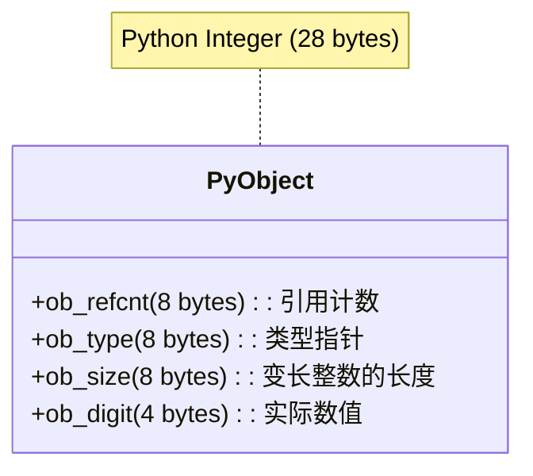

*   **ob_refcnt**：引用计数，用于垃圾回收（GC）。
*   **ob_type**：指向 `int` 类型的指针，告诉解释器这是一个整数。
*   **ob_size**：因为 Python 整数是无限精度的（BigInt），需要记录长度。
*   **ob_digit**：终于到了，这里才真正存储了 `42` 这个数值。

**结论**：你在 Python 中每创建一个整数，就有 **75%** 以上的内存是“管理开销”。

### 4.1.2 解释器的循环开销

当你写一个简单的循环时：

```python
# Python loop
total = 0
for i in range(10_000_000):
    total += i
```

Python 解释器（CPython）在每一步都要做这些事：
1.  **取指**：获取下一条字节码。
2.  **类型检查**：检查 `total` 和 `i` 是什么类型？它们支持 `+` 运算吗？
3.  **解包 (Unboxing)**：从 `PyObject` 中取出实际的 C 整数。
4.  **运算**：调用底层的 C 加法。
5.  **装包 (Boxing)**：把结果重新封装成一个新的 `PyObject`。
6.  **GC 更新**：更新旧对象的引用计数，可能触发垃圾回收。

这就是为什么纯 Python 循环比 C 语言慢 **100 倍到 1000 倍** 的原因。

为了直观展示这种差距，我们对比了不同方式对 1000 万个整数求和的时间：

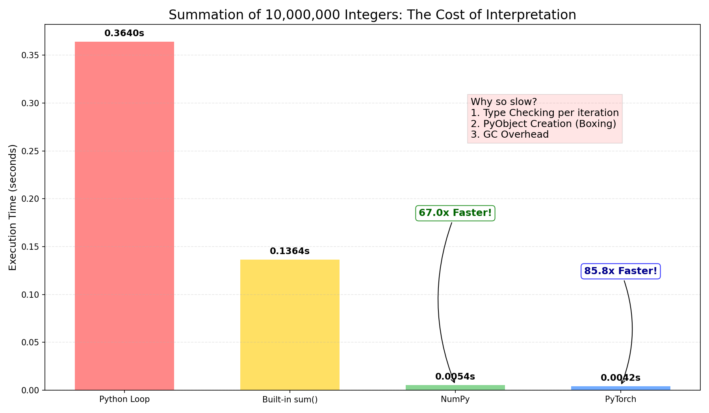

> **实测数据**：
> *   **纯 Python 循环**：~0.39s (基准)
> *   **内置 sum()**：~0.13s (3x Faster) —— 虽然是在 C 层面循环，但仍需处理 PyObject。
> *   **NumPy**：~0.0047s (**83x Faster**) —— 纯 C 数组，无 Boxing/Unboxing，SIMD 加速。
> *   **PyTorch**：~0.0084s (46x Faster) —— 同样是 C++/CUDA 后端。

---

## 4.2 全局解释器锁 (GIL)：多线程的谎言

很多初学者认为：“我的 CPU 有 64 个核，我开 64 个 Python 线程，速度就能快 64 倍！”

**大错特错。**

### 4.2.1 GIL 的物理机制

CPython 解释器的内存管理不是线程安全的。为了防止多线程同时修改同一个对象的引用计数（导致内存泄漏或崩溃），Python 引入了一把**超级大锁**：**Global Interpreter Lock (GIL)**。

**规则**：**在任何时刻，只有一个线程能持有 GIL 并在 CPU 上执行 Python 字节码。**

这就好比一个拥有 64 个灶台（CPU 核）的厨房，但只有 **一把菜刀**（GIL）。
*   即使你雇了 64 个厨师（线程），他们也得排队抢那把菜刀。
*   拿到菜刀的厨师切两下（执行 100 个字节码），就得被迫放下菜刀（释放 GIL），让别人用。

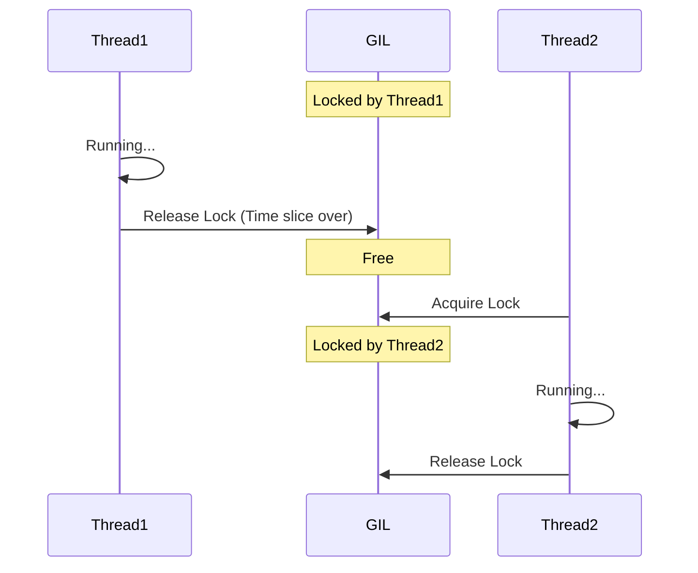

### 4.2.2 什么时候多线程有用？

GIL 锁住的是 **CPU 执行指令**。如果你的任务不需要 CPU（比如等待网络请求、读写磁盘），线程会主动释放 GIL。

*   **IO 密集型任务**（爬虫、Web 请求）：**多线程有用**。
    *   **为什么？** 当 Python 发起 I/O 请求（如读磁盘、发网络包）时，CPU 实际上只是给硬件（网卡、磁盘控制器）下达了指令，然后就“甩手”了。
    *   **谁在干活？** 真正的数据搬运由 **DMA (Direct Memory Access)** 控制器完成，不占用 CPU 时间。
    *   **结果**：CPU 在等待硬件传输数据期间是空闲的，因此 Python 会**主动释放 GIL**，让其他线程利用这段空闲时间执行代码。
*   **CPU 密集型任务**（矩阵乘法、图像处理）：**多线程没用**，甚至因为上下文切换变得更慢。

> **核心概念辨析：进程、线程与协程 (Async)**
>
> 1.  **进程 (Process)**：
>     *   **比喻**：独立的工厂。有自己独立的资源（内存、GIL）。
>     *   **优点**：真并行，完全绕过 GIL。
>     *   **缺点**：开销大，启动慢，通信（IPC）麻烦。
> 2.  **线程 (Thread)**：
>     *   **比喻**：工厂里的工人。共享工厂的资源（内存、GIL）。
>     *   **优点**：启动快，内存共享方便。
>     *   **缺点**：受 GIL 限制，CPU 密集型任务无法并行。
> 3.  **协程 (Async/Await)**：
>     *   **比喻**：一个超级高效的工人，做完A任务等待时（如等IO），立马切换去做B任务。
>     *   **本质**：单线程。**没有**并行，只有**并发**。
>     *   **适用**：高并发 IO（如处理 10000 个网络请求）。

**如何绕过 GIL？**
1.  **多进程 (Multiprocessing)**：每个进程有独立的解释器和 GIL。但代价是进程间通信（IPC）开销大，数据需要序列化（Pickle）。
2.  **C++ 扩展**：NumPy 和 PyTorch 的底层 C++ 代码在执行繁重计算时，会主动释放 GIL。

---

## 4.3 逃离解释器：C++ Extension 与 JIT

既然 Python 这么慢，为什么深度学习还用它？

因为我们**作弊**了。

### 4.3.1 Python 只是胶水

在 PyTorch 中，当你写 `c = a + b` 时，Python 解释器并没有做加法。它只是把“做加法”这个指令发给了底层的 C++ 引擎。

*   **Python 层**：负责 API 定义、自动微分图的构建、参数配置。开销 ~ms 级。
*   **C++/CUDA 层**：负责真正的矩阵运算。开销 ~s/min/hour 级。

只要计算量（运算时间）远大于 Python 的调度开销（调度时间），Python 的慢就不可感知。

### 4.3.2 Torch.compile 与 JIT

但在小算子很多的情况下（比如很多小的 `add`, `mul`, `relu`），Python 的调度开销就会累积变得显著。

PyTorch 2.0 引入了 `torch.compile`，这是一个 **JIT (Just-In-Time)** 编译器。

1.  **图捕获 (Graph Capture)**：它会把你的 Python 代码“看”一遍，把所有的操作记录成一个静态的计算图。
2.  **图优化 (Fusion)**：发现 `x * y + z`，它会将其融合为一个内核（Kernel），避免多次读写内存。
3.  **代码生成**：生成高效的 Triton 或 C++ 代码，完全绕过 Python 解释器执行。

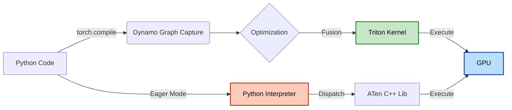

*   **Eager Mode (默认)**：Python 逐行解释，逐个下发任务。灵活性高，但有 Python Overhead。
*   **Compiled Mode**：一次性生成优化后的机器码。丧失部分动态性，但性能接近原生 C++。

---

下一章，我们将深入 **第 5 章：张量的物理视图**，看看这些 C++ 扩展到底是如何在内存中组织数据的。


# 第 5 章：张量的物理视图 (The Physics of Tensors)

> **"A Tensor is a view of a Storage."**  
> —— PyTorch Internals

> **动手实验**：本章配套代码 [assets/tensor_internals.py](assets/tensor_internals.py) 可直接运行，直观展示 Stride、Storage 地址与 Broadcasting 的物理行为。

你在 Python 中看到的 `(3, 4, 5)` 维度的张量，其实是一个美丽的谎言。

在物理内存中，根本不存在“维度”这个概念。内存是一条长长的、一维的线性磁带。无论你的张量是 3 维、4 维还是 100 维，它们在底层的物理存储（Storage）里，都只是一串连续（或不连续）的数字。

本章将带你撕开维度的面纱，通过 **Stride (步长)** 和 **Storage (存储)** 这两个物理概念，彻底理解 PyTorch/NumPy 的底层魔法。

---

## 5.1 内存布局：维度只是幻觉 (Memory Layout)

### 5.1.1 什么是 Stride (步长)？

想象一下，你有一个 $3 \times 4$ 的矩阵 $A$：

$$
A = \begin{bmatrix}
0 & 1 & 2 & 3 \\
4 & 5 & 6 & 7 \\
8 & 9 & 10 & 11
\end{bmatrix}
$$

在物理内存中，这 12 个数字是这样排排坐的（假设是 **Row-major / C-Contiguous**）：

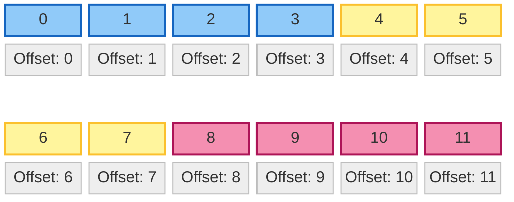

那么，当你访问 `A[1, 2]`（即数字 6）时，计算机怎么知道它在内存的哪个位置？

这就是 **Stride** 的作用。Stride 是一个数组，告诉计算机：**在某个维度上移动一步，物理内存中需要跳过多少个元素？**

对于这个 $3 \times 4$ 的矩阵：
1.  **第 0 维 (行)**：从第 0 行跳到第 1 行（如从 0 跳到 4），内存中需要跳过 **4** 个元素（整个一行的长度）。所以 `stride[0] = 4`。
2.  **第 1 维 (列)**：从第 0 列跳到第 1 列（如从 0 跳到 1），内存中需要跳过 **1** 个元素。所以 `stride[1] = 1`。

**寻址公式**：
$$
\text{Offset} = \text{index}_0 \times \text{stride}_0 + \text{index}_1 \times \text{stride}_1 + \dots
$$

验证一下 `A[1, 2]`：
$$
\text{Offset} = 1 \times 4 + 2 \times 1 = 6
$$
确实，数字 6 就躺在物理内存的第 6 个位置（从 0 开始数）。

### 5.1.2 零拷贝操作：View, Transpose 与 Permute

PyTorch 中最神奇的操作莫过于 `view`、`transpose` 和 `permute`。它们能在微秒级完成，即使张量有几个 G 那么大。

为什么？因为它们**根本没有复制数据**！它们只是修改了 **Stride** 和 **Shape** 这两个元数据（Metadata）。

#### 案例：转置 (Transpose)

当我们执行 `B = A.t()`（转置）时，逻辑上的 $B$ 变成了 $4 \times 3$：

$$
B = \begin{bmatrix}
0 & 4 & 8 \\
1 & 5 & 9 \\
\dots & \dots & \dots
\end{bmatrix}
$$

但在物理内存中，**数据纹丝不动**，还是 `0, 1, 2, 3, 4...`。
那是怎么变的？**改 Stride！**

*   `A.stride` 是 `(4, 1)`
*   `B.stride` 变成了 `(1, 4)`

验证 `B[1, 0]`（即原矩阵的 `A[0, 1]` = 1）：
$$
\text{Offset}_B = 1 \times \text{stride}_0 + 0 \times \text{stride}_1 = 1 \times 1 + 0 \times 4 = 1
$$
物理内存第 1 个位置确实是 **1**。

#### 陷阱：Contiguous (连续性)

虽然转置很快，但它产生了一个副作用：**内存不再连续了**。

*   **行优先 (Row-major / C-Contiguous)**：在一行内移动，内存是连续的。这是 PyTorch/C 的默认格式。
*   **列优先 (Col-major / F-Contiguous)**：在一列内移动，内存是连续的。这是 MATLAB/Fortran 的默认格式。

当你对一个转置后的张量执行 `view` 时，经常会报错：
`RuntimeError: view size is not compatible with input tensor's size and stride...`

**原因**：`view` 要求张量必须是 **C-Contiguous** 的，因为它假设可以通过重新计算 Stride 来映射形状。如果内存本身乱了，简单的数学变换就失效了。

**解决方法**：`.contiguous()`。
这个操作会**真的复制数据**，把内存重新排列成整齐的行优先顺序。

> **为什么 Contiguous 对性能至关重要？**
> 
> **CPU Cache Line**：CPU 读取内存不是一个字节一个字节读的，而是一次“抓”一块（通常 64 字节，即 16 个 float32）。
> *   **连续内存**：当你处理 `A[0, 0]` 时，CPU 顺手把 `A[0, 1]` 到 `A[0, 15]` 都抓进了 L1 Cache。接下来的计算就是极速的。
> *   **不连续内存**：如果 stride 很大（比如列优先访问行），每次访问 `A[0, 0]`, `A[0, 1]` 都需要跳跃到新的内存块，导致 **Cache Miss**，CPU 只能无奈地等待内存响应（慢 100 倍）。

> **性能启示**：
> 1.  尽量减少 `.contiguous()` 调用，因为它会触发内存拷贝（慢！）。
> 2.  但在将 Tensor 传给 CUDA Kernel 或 C++ 扩展前，通常必须保证它是 Contiguous 的。

---

## 5.2 广播机制：无中生有的艺术 (Broadcasting)

当你执行 `A + B` 时，如果 $A$ 是 $(3, 3)$，$B$ 是 $(1, 3)$，PyTorch 会自动把 $B$ “复制” 3 份变成 $(3, 3)$ 再相加。

这真的发生了内存复制吗？**没有**。

### 5.2.1 虚拟扩展 (Virtual Expansion)

广播的本质是将某一维度的 **Stride 设置为 0**。

假设 $B$ 是 `[10, 20, 30]`，形状 `(1, 3)`。物理内存里只有这 3 个数。
`stride` 是 `(3, 1)`（或者是 `(0, 1)`，取决于实现细节，但逻辑上相当于在第 0 维移动不消耗内存偏移）。

当我们把它广播成 $(3, 3)$ 时，逻辑上看是：
$$
\begin{bmatrix}
10 & 20 & 30 \\
10 & 20 & 30 \\
10 & 20 & 30
\end{bmatrix}
$$

但它的 **Stride** 变成了 `(0, 1)`！

验证访问 `B_broadcast[2, 1]`（应该是 20）：
$$
\text{Offset} = 2 \times 0 + 1 \times 1 = 1
$$
物理内存第 1 个位置确实是 **20**。

无论你在第 0 维怎么跳（第 1 行、第 2 行...），因为 stride 是 0，你永远在读物理内存里的同一行数据。

### 5.2.2 为什么要用广播？

1.  **省显存**：计算 Attention Matrix 时，如果直接把 mask 矩阵物理复制成 $B \times H \times S \times S$，显存可能瞬间爆炸。广播让你免费拥有了巨大的矩阵。
2.  **省带宽**：从内存读取数据的量更少了。CPU/GPU 只需要读一行数据，然后在寄存器里反复用，极大地提高了缓存命中率。

---

## 5.3 总结：从物理视角看 Tensor

| 操作 | 逻辑变化 | 物理数据 | Stride 变化 | 性能 |
| :--- | :--- | :--- | :--- | :--- |
| **View / Reshape** | 改变形状 | **不变** | 重新计算 | 极快 ($O(1)$) |
| **Transpose / Permute** | 交换维度 | **不变** | 交换顺序 | 极快 ($O(1)$) |
| **Slice (切片)** | 取子集 | **不变** | 仅仅改变 Offset 和 Stride | 极快 ($O(1)$) |
| **Broadcasting** | 扩展维度 | **不变** | 某维 Stride 设为 0 | 极快 ($O(1)$) |
| **Contiguous** | 无 (内存重排) | **复制重排** | 重置为标准行优先 | 慢 ($O(N)$) |

**下一章预告**：
既然我们知道了数据是如何在内存中“摆放”的，那么如何高效地把它们“喂”给 GPU 呢？第 6 章我们将深入 **数据流水线 (Data Pipeline)**，剖析 DataLoader 的多进程预取机制。

> **附：Expand vs Repeat**
> *   `a.expand(3, 3)`：**零拷贝**。仅仅修改 Stride 为 0。推荐使用。
> *   `a.repeat(1, 3)`：**深拷贝**。会在物理内存中真的把数据复制 3 份。尽量避免。


# 第 6 章：数据流水线与 I/O 优化 (Data Pipeline Optimization)

> **"CPU is the new bottleneck."**
> —— 在 GPU 越来越快的今天，喂数据的速度往往跟不上 GPU 吃数据的速度。

你是否遇到过这样的场景：买了一张 H800，训练模型时 GPU 利用率（Volatile GPU-Util）却只有 30%？
打开 `nvtop` 一看，GPU 经常在 0% 和 100% 之间跳变（锯齿状波动）。

这通常不是 GPU 的问题，而是 **I/O 瓶颈**。你的 GPU 就像一个饥饿的法拉利引擎，而你的 DataLoader 就像是用吸管在给它喂油。

本章将深入 PyTorch DataLoader 的内部机制，教你如何打造一条能喂饱 GPU 的高速数据流水线。

---

## 6.1 PyTorch DataLoader 深度解析

### 6.1.1 核心机制：多进程预取 (Multi-process Prefetching)

Python 的 GIL 锁导致单线程无法利用多核 CPU 进行并行数据处理。PyTorch 的 `DataLoader` 通过 `num_workers > 0` 开启多进程模式来绕过这个问题。

**工作流程图解**：

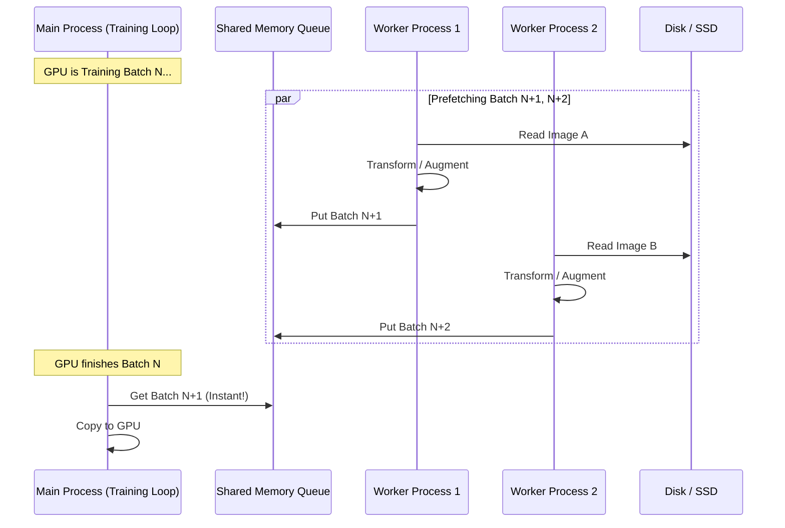

*   **num_workers=0**：主进程自己干活。读磁盘 -> 处理 -> 训练 -> 读磁盘... 串行执行，慢！
*   **num_workers=N**：N 个工人提前在后台读数据、做 Augmentation，并把处理好的 Batch 放到内存队列里。主进程取数据时，数据已经准备好了。

> **最佳实践**：`num_workers` 设置为 CPU 核心数（或核心数/GPU数）。设置过大反而会增加进程切换开销和内存占用。

### 6.1.2 锁页内存 (Pin Memory)

从 CPU 内存（Host）传输数据到 GPU 显存（Device）时，数据必须先被拷贝到一块“锁页内存”（Page-locked / Pinned Memory）中，然后才能通过 PCIe 总线传输。

*   **pin_memory=False**（默认）：
    1.  数据在普通的可分页内存（Pageable Memory）。
    2.  驱动程序隐式分配一块临时的锁页内存。
    3.  CPU 将数据从可分页内存 **拷贝** 到临时锁页内存。
    4.  GPU 通过 DMA 从锁页内存读取数据。

*   **pin_memory=True**：
    1.  DataLoader 直接把数据分配在锁页内存中。
    2.  GPU 直接通过 DMA 读取数据。**少了一次 CPU 拷贝！**

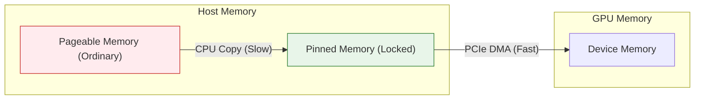

> **结论**：在 DataLoader 中永远开启 `pin_memory=True`，除非你的内存非常吃紧。

### 6.1.3 Collate_fn：被忽视的瓶颈

`collate_fn` 负责将多个样本（List of Tensors）拼接成一个 Batch（Tensor）。
如果你的样本包含变长数据（如文本、音频），或者有复杂的自定义逻辑，`collate_fn` 可能会在主进程（或 Worker 进程）中消耗大量时间。

---

## 6.2 高性能文件格式与数据表示

选择正确的文件格式，能让 I/O 速度提升 10 倍以上。

### 6.2.1 文本与扁平数据：CSV/JSON/JSONL 

*   **CSV**：
    *   **优点**：体积小，Excel 可打开，通用性强。
    *   **缺点**：不支持嵌套结构；解析需要字符串分割，速度中等。
*   **JSON**：
    *   **优点**：支持复杂嵌套结构，Web API 标准格式。
    *   **缺点**：**内存杀手**。标准 JSON 文件通常是一个巨大的列表 `[...]`。解析器（Parser）为了验证 JSON 的合法性（匹配首尾括号），往往需要把整个文件加载到内存中。
    *   **场景**：如果你的数据集有 100GB，用 JSON 存，读取时内存直接爆炸（OOM）。
    
    ```json
    // data.json: 整个文件是一个巨大的 Array
    [
      {"id": 1, "content": "第一条数据..."},
      {"id": 2, "content": "第二条数据..."},
      // ... 还要读到第 1000 万行才能遇到 "]"
    ]
    ```

*   **JSONL (JSON Lines)**：
    *   **优点**：**流式读取 (Streaming Friendly)**。每一行都是一个独立的、合法的 JSON 对象。读取程序不需要看文件的结尾，读一行就能用一行。
    *   **场景**：100GB 的文件，内存占用仅需几 KB（一行的大小）。支持断点续训（记录读到了第几行即可）。
    
    ```json
    // data.jsonl: 每一行相互独立，没有逗号，没有外层 []
    {"id": 1, "content": "第一条数据..."}
    {"id": 2, "content": "第二条数据..."}
    // 读完这一行，内存就可以释放，立刻读下一行
    ```

### 6.2.2 列式存储：Parquet / Arrow

对于表格型数据（如推荐系统的特征），Parquet 和 Arrow 是神一般的存在。二者经常成对出现，但定位不同：
*   **Parquet**：**磁盘**上的存储格式（面向空间压缩优化）。
*   **Arrow**：**内存**中的数据格式（面向 CPU SIMD 计算优化）。

#### 1. Parquet 的列式存储原理 (Disk Optimization)

*   **行式存储 (Row-based, e.g., CSV/JSONL)**：数据按行物理存储。读取“年龄”这一列时，必须扫描整行数据（包括你不需要的“姓名”、“ID”等）。
*   **列式存储 (Column-based, e.g., Parquet)**：数据按列物理存储。读取“年龄”这一列时，**只读取该列的物理块**，完全跳过其他列。

**存储结构对比图解**：

假设我们有如下数据表：

| ID | Name | Age |
| :--- | :--- | :--- |
| 1 | Alice | 25 |
| 2 | Bob | 30 |

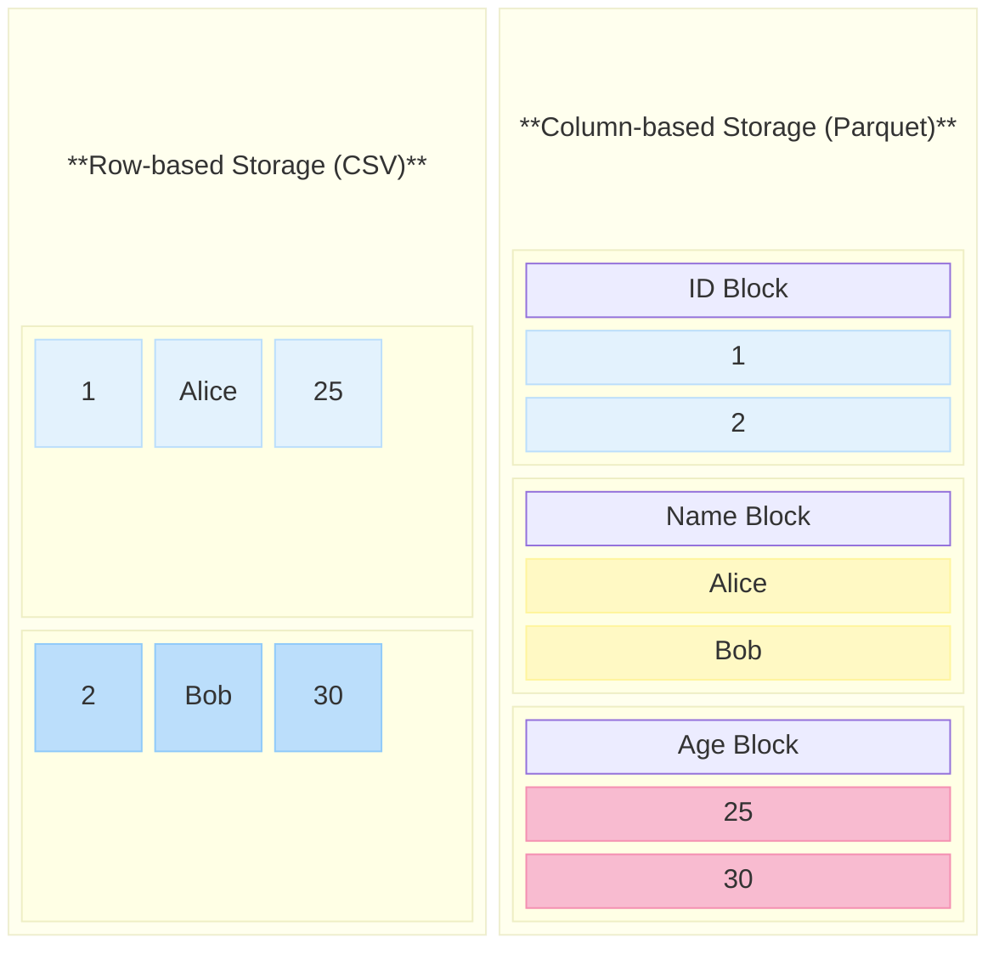

*   **列式存储优势**：如果你只训练 `Age` 列，Parquet 允许你**只读取粉色块 (Age Block)**，忽略蓝色 (ID) 和黄色 (Name) 块。I/O 量瞬间降低 66%。
*   **压缩率**：同一列的数据类型相同（如 Age 都是整数），压缩效果极佳（Snappy / Zstd）。

#### 2. Apache Arrow：零拷贝的高速公路 (Memory Optimization)

当我们将 Parquet 文件读入内存（如 Pandas 或 PyTorch）时，传统流程需要进行**序列化/反序列化 (SerDe)**，这是巨大的 CPU 开销。

Arrow 定义了一种**标准化的内存格式**。无论你是 Python (Pandas)、C++、Java 还是 Spark，只要大家都遵守 Arrow 内存规范：
1.  **零拷贝 (Zero-Copy)**：从 Spark 传数据给 Pandas，或者从 Pandas 传给 PyTorch，不需要复制内存，直接传递指针即可。
2.  **SIMD 友好**：Arrow 的内存布局是紧凑对齐的，CPU 可以直接用 SIMD 指令（如 AVX-512）对一整列数据进行并行计算。

> **HuggingFace Datasets 的秘密**：
> HuggingFace 的 `datasets` 库底层完全基于 Arrow。当你加载一个 100GB 的数据集时，它并没有把数据读进 Python 的 Heap 内存，而是通过 `mmap` 将 Arrow 格式的文件映射到内存。
> 这就是为什么你能在 8GB 内存的笔记本上加载 1TB 的数据集，并且索引速度极快。

### 6.2.3 科学计算容器：HDF5 / NPY

这两个格式是科学计算（Scientific Computing）领域的“硬盘”。它们不关心“表格”或“列”，它们只关心一个东西：**多维数组 (N-dimensional Arrays)**。

*   **NPY (.npy / .npz)**：
    *   **本质**：它是 NumPy 内存数组的“快照”。把内存里的二进制数据（C-Array）直接 Dump 到磁盘上，加上一个简单的 Header 告诉 NumPy 数据类型和形状。
    *   **极速读取**：读取 `.npy` 文件时，几乎等于磁盘的顺序读取速度（Sequential Read）。
    *   **局限**：`.npy` 只能存一个数组；`.npz` 是多个 `.npy` 的 Zip 压缩包，不支持部分读取（必须解压）。

*   **HDF5 (Hierarchical Data Format)**：
    *   **本质**：**文件系统中的文件系统**。你可以在一个 `.h5` 文件里创建文件夹（Groups）和文件（Datasets）。
    *   **切片读取 (Slicing)**：这是 HDF5 的杀手锏。假设你有一个 1TB 的数组 `data[1000000, 1024]` 存在磁盘上。
        *   用 NPY：你需要把 1TB 读进内存才能访问 `data[0]`。
        *   用 HDF5：你可以只执行 `x = f['data'][0:10]`。HDF5 只会从磁盘读取这 10 行数据对应的字节，**内存占用极小，速度极快**。

### 6.2.4 安全与速度的新星：Safetensors

HuggingFace 推出的新格式，正在全面取代 PyTorch 默认的 Pickle (`.bin` / `.pth`)。

#### 1. Pickle 的“任意代码执行”漏洞
PyTorch 的 `torch.load()` 默认使用 Python 的 `pickle` 模块。Pickle 不仅仅是存数据，它还能存“指令”。
如果里面隐藏了危险代码，当你加载这个模型时，这行代码就会执行！造成严重后果。
```python
import os; os.system("rm -rf /") 
```
这就是为什么现在的 Model Hub 都会标记 "Pickle Scanning" 状态。

#### 2. Safetensors 的极致优化
Safetensors 是一个**纯粹的数据容器**，它只有两个部分：
1.  **Header (JSON)**：告诉程序每个 Tensor 的名字、Shape、Dtype 以及在文件中的**字节偏移量 (Offset)**。
2.  **Body (Raw Bytes)**：紧接着 Header，存储纯粹的二进制 Tensor 数据。

**零拷贝 (Zero-copy) 与 mmap**：
当你加载一个 100GB 的 Safetensors 模型时：
```python
from safetensors.torch import load_file
# 这一步瞬间完成，不消耗 100GB 内存！
state_dict = load_file("model.safetensors") 
```
操作系统使用 **mmap (内存映射)** 技术，把磁盘文件“映射”到虚拟内存地址空间。
*   **物理内存**：此时可能只占用了几 MB（存 Header）。
*   **按需加载**：当你真正进行 `layer1.weight + x` 计算时，CPU 触发“缺页中断 (Page Fault)”，操作系统才会把 `layer1.weight` 对应的磁盘数据搬进物理内存。

> **对比**：加载 Pickle 文件时，Python 必须把整个文件读入内存，解析成对象，不仅慢，而且内存瞬间爆炸（峰值内存通常是文件大小的 2 倍以上）。

---

## 6.3 Linux 系统的 I/O 机制

### 6.3.1 Page Cache：操作系统的神助攻

你是否发现，同一个数据集，第一遍训练很慢，第二遍突然变快了？
这不是玄学，是 Linux 的 **Page Cache**。

Linux 会把空闲的内存用作文件缓存。当你读取文件时，Linux 会悄悄把它留在内存里。下次再读，直接从内存拿，速度从 SSD 的 500MB/s 飙升到内存的 50GB/s。

> **启示**：买大内存！如果你的内存能装下整个数据集，训练速度将起飞。

### 6.3.2 DMA (Direct Memory Access)

在没有 DMA 的年代，硬盘读数据到内存，需要 CPU 亲自搬运每一个字节。CPU 累得要死，没空干别的。

有了 DMA（直接内存访问），CPU 只需要发号施令：“硬盘，把这 1GB 数据搬到内存地址 X，搬完了叫我。”
然后 CPU 就可以去算梯度了。硬盘和内存之间自己建立通道传输数据。

**Pin Memory** 的核心原理，就是为了配合 DMA，确保数据在传输过程中地址不会变（不会被操作系统换页到 Swap）。

---

## 6.4 总结：打造 I/O 及其流水线

1.  **格式选择**：大模型语料用 **JSONL** 或 **Parquet**；图像/视频尽量存成打包格式（如 WebDataset）避免百万级小文件。
2.  **DataLoader**：
    *   `num_workers = CPU Cores`
    *   `pin_memory = True`
    *   `prefetch_factor = 2`
3.  **硬件**：把数据集放在 NVMe SSD 上，不要用机械硬盘。
4.  **系统**：利用好 Page Cache，甚至使用 `vmtouch` 工具强制把数据集锁在内存里。

**下一章预告**：
数据准备好了，计算核心也理解了。接下来我们将进入最硬核的部分——**GPU 编程与算子优化**。你将看到 CUDA 核心是如何被调度的，以及为什么写好一个算子比写好模型更难。


