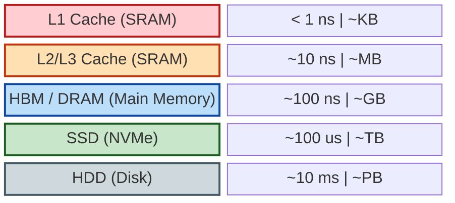

# 第 1 章：存储金字塔与数据搬运 (The Memory Hierarchy)

> **"Data movement is the enemy."**  
> —— Bill Dally (NVIDIA Chief Scientist)

对于习惯了数学推导的你来说，计算机世界往往被抽象为一个图灵机：拥有无限的纸带（内存），每一步读写操作的代价是 $O(1)$。在算法课上，我们只关心计算复杂度（Time Complexity），比如矩阵乘法是 $O(N^3)$。

然而，在物理世界中，**“读取数据”和“计算数据”的代价有着天壤之别**。

想象一下：
- **CPU 寄存器** 是你的大脑，运算极快，但只能记住几个数字。
- **L1/L2 缓存** 是你的办公桌，伸手就能拿到数据，但空间有限。
- **内存 (DRAM)** 是隔壁房间的书架，去拿一次书需要几分钟。
- **硬盘 (SSD/HDD)** 是几公里外的图书馆，去取一次书需要几天甚至几周。

对于大模型训练而言，**性能瓶颈往往不在于你算得有多快，而在于你搬运数据的速度有多慢**。这就是为什么你的 GPU 利用率总是忽高忽低，为什么 Transformer 的优化几乎全部围绕着“减少显存读写”展开。

本章将带你从物理视角重新审视计算机，理解为什么 **Memory Wall (内存墙)** 是 AI 时代的最大挑战。

---

## 1.1 从 SRAM 到 HDD：速度与容量的权衡

计算机存储系统是一个严格的金字塔结构。越靠近 CPU/GPU 核心的存储器，速度越快，但造价越昂贵，容量也越小。

### 1.1.1 存储金字塔 (The Memory Hierarchy Pyramid)

我们可以用一个数量级图表来直观感受这种巨大的差异（时间单位归一化为“CPU 周期”或人类可感知的“秒”）：

**关键洞察：**

1.  **L1/L2/L3 Cache (SRAM)**:
    -   **物理本质**：静态随机存取存储器 (Static RAM)。由 6 个晶体管 (Transistors) 存储 1 bit，速度极快，不需要刷新。
    -   **命中率 (Hit Rate)**：如果 CPU 需要的数据在 Cache 里，只需 ~1-4 个时钟周期。如果不在 (Cache Miss)，CPU 就必须停下来等待几百个周期去内存取。
    -   **AI 启示**：矩阵乘法之所以要做 Tiling (分块)，就是为了让切分后的小矩阵能塞进 L1/L2 Cache，从而复用数据，避免反复去读慢速内存。

2.  **DRAM (Dynamic RAM) & HBM (High Bandwidth Memory)**:
    -   **物理本质**：由 1 个电容和 1 个晶体管组成。电容会漏电，所以每隔几毫秒必须“刷新”一次（这就是“动态”的由来）。
    -   **带宽 (Bandwidth)**：这是大模型的命门。
        -   普通 DDR4/DDR5 内存带宽：~50-100 GB/s。
        -   **HBM (高带宽内存)**：NVIDIA A100/H100 显卡专用的内存。它通过 TSV (硅通孔) 技术把多个 DRAM 芯片垂直堆叠起来，像盖楼一样。
        -   **H100 的 HBM3 带宽**：高达 **3.35 TB/s**！是普通内存的 30-60 倍。
    -   **为什么显卡那么贵？** HBM 的良率低、工艺复杂，占据了高端 GPU 成本的很大一部分。

3.  **SSD/HDD**:
    -   虽然 SSD 很快，但对比内存依然是蜗牛。在训练大模型时，我们尽量避免在训练过程中频繁读写磁盘（除非是 DataLoader 的预取阶段）。

### 1.1.2 延迟 (Latency) vs 带宽 (Bandwidth)

这是两个经常被混淆的概念。

*   **延迟 (Latency)**：从发出请求到收到第一个字节的时间。（水管有多长）
*   **带宽 (Bandwidth)**：单位时间内能传输的数据量。（水管有多粗）

**比喻**：
*   **低延迟**：法拉利跑车送 U 盘。响应快，但一次送的数据少。
*   **高带宽**：装满硬盘的卡车在高速公路上跑。启动慢（延迟高），但一旦跑起来，吞吐量惊人。

**GPU 是吞吐量怪兽 (Throughput Oriented)**，它容忍高延迟，但极其依赖高带宽。为了掩盖内存的高延迟，GPU 会同时运行成千上万个线程——当一部分线程在等内存数据时，另一部分线程利用 ALU (算术逻辑单元) 进行计算。

---

## 1.2 数据搬运的代价

在冯·诺依曼架构中，计算单元 (CPU/GPU Core) 和存储单元 (Memory) 是分离的。数据必须通过总线 (Bus) 在两者之间搬运。

### 1.2.1 冯·诺依曼瓶颈 (Von Neumann Bottleneck)

现代处理器的计算能力增长速度，远远超过了内存带宽的增长速度。

> **科普：什么是 TFLOPS？**
>
> 在阅读显卡参数时，你经常会看到这个词。它是衡量计算机算力最核心的指标。
> *   **FLOPS** (Floating Point Operations Per Second)：每秒浮点运算次数。
> *   **GFLOPS** (Giga) = $10^9$ 次/秒 (十亿)
> *   **TFLOPS** (Tera) = $10^{12}$ 次/秒 (万亿) —— 目前主流 GPU 的量级。
> *   **PFLOPS** (Peta) = $10^{15}$ 次/秒 (千万亿) —— 超级计算机或 GPU 集群的量级。
>
> 当我们说 "H100 有 1000 TFLOPS 算力" 时，意味着它每秒钟能做 **一千万亿次** 乘法或加法运算。这个数字非常恐怖，但前提是——**数据必须已经在它的寄存器里准备好了**。

*   **计算能力**：H100 FP16 算力 $\approx$ 1000 TFLOPS ($10^{15}$ ops/s)
*   **内存带宽**：H100 HBM3 带宽 $\approx$ 3.35 TB/s ($3.35 \times 10^{12}$ bytes/s)

这意味着：**GPU 每秒钟能进行的运算次数，是它能搬运的数据量的 300 倍以上！**

如果你写的算法（比如简单的向量加法 `C = A + B`）只做一次运算就需要读写一次内存，那么 GPU 的计算核心将有 99% 的时间在空转，等待数据从内存送达。这就是 **Memory-bound (带宽受限)**。

### 1.2.2 算术强度 (Arithmetic Intensity)

为了量化这个问题，我们引入 **算术强度 (Arithmetic Intensity)**，记为 $I$：

$$ I = \frac{\text{FLOPS (浮点运算次数)}}{\text{Bytes (内存读写字节数)}} $$

*   **单位**：FLOPs/Byte

**案例分析**：

1.  **向量加法 (Vector Add)**: $C = A + B$ (假设 $N$ 个 float16 元素)
    *   运算：$N$ 次加法。
    *   访存：读 $A$ ($2N$ bytes), 读 $B$ ($2N$ bytes), 写 $C$ ($2N$ bytes)。共 $6N$ bytes。
    *   $I = \frac{N}{6N} = 1/6$ FLOPs/Byte。
    *   **结论**：极低的算术强度，典型的 Memory-bound。

2.  **矩阵乘法 (Matrix Multiply)**: $C = A \times B$ ($N \times N$ 矩阵)
    *   运算：$2N^3$ 次 (乘加)。
    *   访存：读 $A$ ($N^2$), 读 $B$ ($N^2$), 写 $C$ ($N^2$)。共 $3N^2$ (假设 float32 为 4 bytes，则 $12N^2$)。
    *   $I \approx \frac{2N^3}{12N^2} = \frac{N}{6}$。
    *   **结论**：随着 $N$ 增大，算术强度线性增加！只要 $N$ 足够大，就是 Compute-bound。这就是为什么深度学习如此依赖矩阵乘法。

### 1.2.3 Roofline Model (屋顶模型)

这是性能分析中最著名的模型。它告诉我们要想达到硬件的峰值性能，算法需要满足什么条件。

$$ \text{Attainable Performance} = \min(\text{Peak Performance}, \text{Peak Bandwidth} \times \text{Arithmetic Intensity}) $$

我们可以用 Python 绘制一个简单的 Roofline Model 示意图（见下图）：

> **图解说明**：
> *   **横轴 (Arithmetic Intensity)**：计算密度，即每搬运 1 Byte 数据能做多少次浮点运算。
> *   **纵轴 (Performance)**：实际达到的算力 (GFLOPS)。
> *   **左侧斜坡区 (Memory-Bound)**：**带宽受限**。此时算力并未饱和，瓶颈在于数据搬运太慢。无论你增加多少计算核心，性能都不会提升，除非增加显存带宽。大多数简单的向量操作（如 Element-wise add）都在这里。
> *   **右侧平顶区 (Compute-Bound)**：**算力受限**。此时数据搬运已经跟上了，瓶颈在于计算单元（ALU）忙不过来。矩阵乘法（MatMul）、卷积（Conv）通常在这里。
> *   **拐点**：这是硬件的最佳工作点。为了达到峰值性能，你的算法必须提供足够的计算密度。

---

### 1.3 为什么 Attention 是 Memory-bound?

Transformer 的核心 Attention 机制：

$$ \text{Attention}(Q, K, V) = \text{softmax}(\frac{QK^T}{\sqrt{d_k}})V $$

在标准的实现中，我们需要计算 $S = QK^T$，得到一个 $N \times N$ 的矩阵（$N$ 是序列长度）。
然后对 $S$ 做 Softmax，再读写 $N \times N$ 的矩阵。

当 $N$ 很大时（长文本），$N \times N$ 的中间矩阵会变得巨大，导致频繁的 HBM 读写。
虽然矩阵乘法本身是 Compute-bound，但中间结果的 **读写 (IO)** 拖累了整体速度。

这就是 **FlashAttention** 诞生的背景：它通过 Tiling 技术，在 GPU 的 SRAM (L1/Shared Memory) 中一次性计算完 Softmax 的一部分，**坚决不把 $N \times N$ 的中间大矩阵写回 HBM**。

> **核心结论**：在 AI 系统优化中，**减少 HBM 访问次数** 往往比 **减少计算量** 更重要。

---

## 下一步

现在我们理解了数据搬运的物理代价。下一章，我们将深入 CPU 和 GPU 的内部，看看这些计算核心是如何利用流水线和并行机制来压榨每一分性能的。

---

