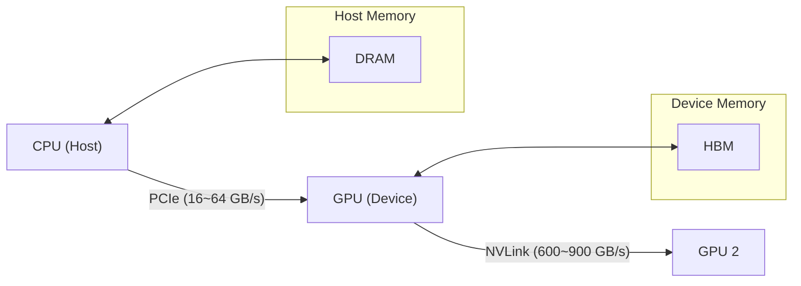

# 第 2 章：计算核心与并行范式 (The Compute Engines)

> **"CPU is a latency beast; GPU is a throughput monster."**

如果说第一章我们讨论的是“仓库”（存储）和“运输队”（带宽），那么这一章我们将走进“工厂”内部，拆解那些真正干活的机器——CPU 和 GPU。

对于数学背景的同学来说，理解硬件最困难的地方在于：**硬件不是在做数学运算，而是在处理比特流**。为了让物理电路跑得更快，工程师们设计了极其复杂的控制逻辑（流水线、分支预测、超线程）。

理解这些机制，你就会明白：为什么写了 `for` 循环会慢？为什么 GPU 极其讨厌 `if-else`？

---

## 2.1 CPU：逻辑复杂的控制者

CPU (Central Processing Unit) 是计算机的“大管家”。它的设计目标是：**尽可能快地执行复杂的串行代码**。

### 2.1.1 流水线 (Pipeline) —— 为什么一条指令不是一步完成的？

在数学上，$a = b + c$ 是一步操作。但在 CPU 内部，这行代码被拆解成了多个微步骤，就像汽车装配线一样：

1.  **Fetch (取指)**：从内存取指令。
2.  **Decode (译码)**：翻译指令（这是加法？还是跳转？）。
3.  **Execute (执行)**：ALU 真正进行加法运算。
4.  **Write Back (写回)**：把结果存回寄存器。

**流水线的魔力**：
假设每个步骤需要 1ns。如果不流水线化，执行一条指令需要 4ns。
一旦流水线填满，虽然单条指令的延迟（Latency）还是 4ns，但平均每 1ns 就能产出一条结果！

> **代码启示**：数据依赖 (Data Dependency) 是流水线的杀手。
> 如果 `b = a + 1` 必须等 `a = 1 + 1` 算完，流水线就会**停顿 (Stall)**，性能瞬间暴跌。

### 2.1.2 分支预测 (Branch Prediction) —— CPU 的“赌博”机制

流水线最怕遇到什么？**分支跳转 (`if-else`)**。

当 CPU 遇到 `if (x > 0)` 时，它不知道下一条指令该去读 `True` 的分支还是 `False` 的分支。如果等算出 `x > 0` 的结果再取指，流水线就断了。

于是，CPU 会进行**分支预测**：根据历史记录，“猜”你会走哪条路，并提前把那条路上的指令塞进流水线执行。

*   **猜对了**：流水线满载运行，性能起飞。
*   **猜错了**：**Pipeline Flush**！刚才提前跑的所有指令全部作废，清空流水线，从正确的分支重新开始。代价极其昂贵（几十个时钟周期）。

> **Python 优化案例**：
> 在处理数组时，**先排序再遍历** 有时比直接遍历更快。为什么？
> 因为排序后的数据（如 `TTTTFFFF`）让分支预测器极其容易猜中（这就是著名的 StackOverflow 案例：*Why is processing a sorted array faster than processing an unsorted array?*）。

### 2.1.3 SIMD (Single Instruction, Multiple Data)

这是 CPU 并行计算的基础，也是向量化 (Vectorization) 的物理实现。

*   **标量模式**：`a[0] + b[0]`，`a[1] + b[1]`，`a[2] + b[2]`，`a[3] + b[3]`。做 4 次加法，发 4 条指令。
*   **SIMD 模式 (AVX/NEON)**：CPU 拥有超宽的寄存器（如 256-bit AVX2，能装 8 个 float32）。一条指令 `vaddps`，直接把 8 对数字同时相加。

**NumPy 的秘密**：当你写 `np.array([1,2]) + np.array([3,4])` 时，底层调用的就是 SIMD 指令。如果你写 Python `for` 循环，就是回到了低效的标量模式。

---

## 2.2 GPU：吞吐为王的暴力美学

GPU (Graphics Processing Unit) 的设计哲学与 CPU 截然不同。它不擅长复杂的逻辑控制（预测、乱序执行），而是**堆砌了成千上万个简单的计算核心**。

### 2.2.1 SIMT (Single Instruction, Multiple Threads)

这是 NVIDIA CUDA 编程模型的核心。

想象一下，你有一个连队（32 个士兵）。指挥官（控制单元）发出一声号令：“向前走一步！”（Instruction）。
于是，32 个士兵（Threads）**同时**迈出了腿。

这就是 **SIMT**：**单条指令，驱动多线程**。

*   **Grid / Block / Thread**：GPU 的线程层级结构。
*   **Warp (线程束)**：这是 GPU 调度的最小单位（通常是 32 个线程）。**这 32 个线程必须在同一时刻执行同一条指令**。

### 2.2.2 Warp Divergence (分支发散) —— GPU 的噩梦

既然 32 个线程必须执行同一条指令，那如果代码里写了 `if-else` 怎么办？

```python
if (thread_id < 16):
    do_A()
else:
    do_B()
```

在 CPU 上，线程 A 走 A 路，线程 B 走 B 路，互不干扰。
但在 GPU 的同一个 Warp 里：
1.  指挥官大喊：“执行 A！”
    *   前 16 个线程干活。
    *   **后 16 个线程必须发呆（Masked Off）**，等待 A 干完。
2.  指挥官大喊：“执行 B！”
    *   前 16 个线程发呆。
    *   后 16 个线程干活。

**结果**：总耗时 = A 的耗时 + B 的耗时。**硬件利用率直接腰斩一半！**

> **AI 启示**：这就是为什么神经网络算子（如 ReLU, MatMul, Conv）很少有复杂的逻辑判断，而是倾向于纯粹的数学运算。`Dropout` 使用的是数学掩码（乘 0），而不是 `if` 判断。

### 2.2.3 Tensor Core：为 AI 而生的核武器

普通的 CUDA Core 可以做任意运算（加减乘除、正弦余弦）。
但在深度学习中，99% 的计算量都是矩阵乘法 ($D = A \times B + C$)。

NVIDIA 从 Volta 架构（V100）开始引入了 **Tensor Core**：
它是一个专用的硬件电路，**在一个时钟周期内完成 $4 \times 4$ 矩阵乘加运算**。

*   **效率**：比普通 CUDA Core 快几倍甚至几十倍。
*   **代价**：必须满足特定的形状限制（如矩阵维度必须是 8 或 16 的倍数）和精度限制（通常是 FP16/BF16）。

这就是为什么我们在 PyTorch 中建议 `batch_size` 设为 8 的倍数，甚至最好是 2 的幂。

---

## 2.3 异构计算与 PCIe/NVLink

在 AI 服务器中，CPU 和 GPU 是协作关系。



### 2.3.1 PCIe：细水管瓶颈

CPU 和 GPU 之间通过 **PCIe 总线** 连接。
*   **PCIe 4.0 x16**：带宽约 64 GB/s。
*   **对比 HBM**：GPU 内部显存带宽 2000+ GB/s。

**差距是 30 倍！**

> **工程陷阱**：
> 很多初学者写代码时，会在训练循环里频繁进行 `tensor.cpu()` 或 `tensor.item()` 操作。
> 这会导致数据在 CPU 和 GPU 之间反复通过 PCIe 细水管搬运，并且由于 Python 的同步机制，会强制 GPU 等待 CPU，导致训练速度极其缓慢。
>
> **原则**：**一旦数据上了 GPU，就别让它轻易下来。**

### 2.3.2 NVLink：多卡互联的基石

当一个模型大到单张卡放不下时，我们需要多张卡一起跑。
如果多张卡之间也走 PCIe 通信，速度会慢到无法接受。

**NVLink** 是 NVIDIA 专有的高速互联技术，让 GPU 之间可以直接通信，绕过 CPU 和 PCIe。
在 H100 上，NVLink 带宽高达 900 GB/s，几乎接近本地显存的速度。这使得 **8 张 GPU 看起来像是一个巨大的虚拟 GPU**，为训练万亿参数大模型提供了可能。

---

## 总结：如何写出“硬件友好”的代码？

1.  **CPU 是管家，GPU 是工人**：复杂的逻辑、数据预处理交给 CPU；繁重的、重复的矩阵运算交给 GPU。
2.  **避免 GPU 分支**：在 Shader/Kernel 代码中尽量少用 `if-else`，多用数学掩码。
3.  **喂饱 Tensor Core**：矩阵维度对齐到 8/16/32 的倍数，使用 FP16/BF16。
4.  **减少 PCIe 传输**：Batch 越大越好，减少 CPU/GPU 交互频率。

---

## 下一步

既然硬件只认识 0 和 1，那么数学上的实数（Real Number）在计算机里究竟是如何表示的？为什么 `0.1 + 0.2 != 0.3`？这种精度误差会不会毁了我们的模型训练？

下一章：**第 3 章：精度与数值的艺术**。
