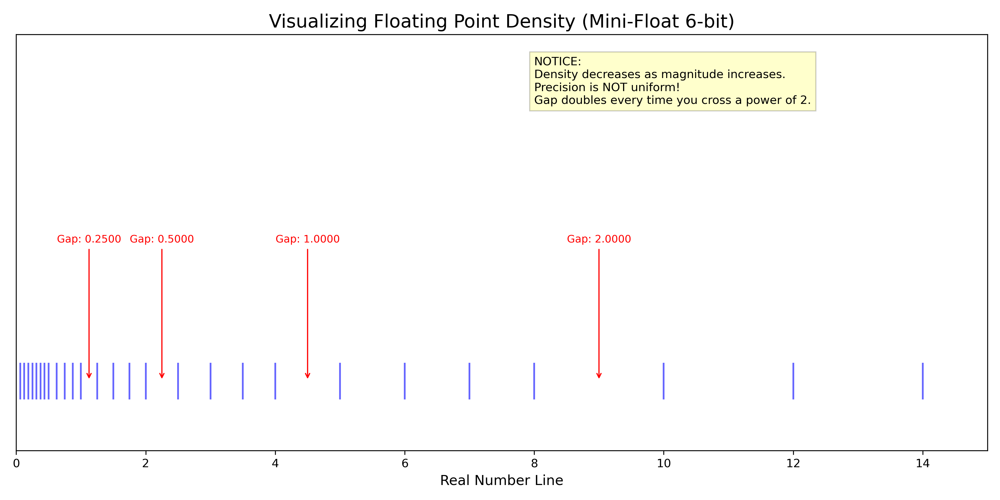

# 第 3 章：精度与数值的艺术 (Numerical Precision)

> **"God made the integers, all else is the work of man."** —— Leopold Kronecker

在数学世界里，实数轴是连续的、无限稠密的。但在计算机的硅基世界里，**“实数”是不存在的**。

计算机只有有限的比特（0 和 1）。当我们试图用有限的比特去模拟无限的实数时，必然会付出代价——这个代价就是**精度（Precision）**。

对于 AI 工程师来说，理解这个代价至关重要。为什么 BERT 模型用 FP16 训练会比 FP32 快一倍且显存减半？为什么 LLaMA 用 BF16 而不是 FP16？为什么 `0.1 + 0.2 != 0.3`？

这一章，我们将揭开浮点数的物理面纱。

---

## 3.1 浮点数陷阱：为什么计算机算不准？

### 3.1.1 科学计数法的二进制版本

在 IEEE 754 标准中，一个浮点数被存储为三部分：

$$
\text{Value} = (-1)^{\text{Sign}} \times (1 + \text{Mantissa}) \times 2^{\text{Exponent} - \text{Bias}}
$$

*   **符号位 (Sign)**：正还是负？
*   **指数位 (Exponent)**：决定了数值的**范围**（数量级）。存储的是 `真实指数 + Bias`。
    *   **Bias 的由来**：为了让指数能够表示负数（如 $2^{-3}$），IEEE 754 规定指数位采用**移码 (Offset Binary)** 表示。
    *   公式：$\text{Bias} = 2^{k-1} - 1$，其中 $k$ 是指数位的位数。
    *   例如 FP32 有 8 位指数，$\text{Bias} = 2^{8-1} - 1 = 127$。
*   **尾数位 (Mantissa)**：决定了数值的**精度**（有效数字）。

| 格式 | 总位数 | 符号位 | 指数位 (Range) | 尾数位 (Precision) | Bias |
| :--- | :---: | :---: | :---: | :---: | :---: |
| **FP32** | 32 | 1 | 8 | 23 | 127 |
| **FP16** | 16 | 1 | 5 | 10 | 15 |
| **BF16** | 16 | 1 | 8 | 7 | 127 |

> **计算示例 1：如何从机器码反推数值？(FP16)**
>
> 假设内存中有一个 FP16：`1 | 10010 | 1000000000`
>
> 1.  **符号位**：`1` $\rightarrow$ 负数。
> 2.  **指数位**：`10010` (十进制 18)。
>     *   真实指数 = $18 - 15 (\text{Bias}) = 3$。
> 3.  **尾数位**：`100...` (10位)。
>     *   补上隐含的 `1.` $\rightarrow$ $1.1$ (二进制)。
>     *   $1.1_2 = 1 + 2^{-1} = 1.5$ (十进制)。
> 4.  **最终计算**：
>     *   $\text{Value} = -1 \times 1.5 \times 2^3 = -1.5 \times 8 = -12.0$
>
> **计算示例 2：计算机如何表示 0.15625？(FP16)**
> 
> 1.  **科学计数法**：$0.15625 = 1.25 \times 2^{-3}$
> 2.  **符号位**：正数 $\rightarrow$ `0`
> 3.  **指数位**：
>     *   真实指数是 $-3$。
>     *   在 FP16 中，存储指数 = 真实指数 + Bias = $-3 + 15 = 12$。
>     *   $12$ 的二进制是 `01100`。
> 4.  **尾数位**：
>     *   $1.25$ 的二进制是 $1.01$。
>     *   去掉隐含的整数 `1`，剩下 `01`。
>     *   补齐 10 位：`0100000000`。
> 
> **最终机器码**：`0 | 01100 | 0100000000`

这就好比用一把尺子去测量宇宙：
*   **指数**决定了尺子有多长。
*   **尾数**决定了尺子上的刻度有多密。

### 3.1.2 浮点数的“稀疏”分布

初学者最容易忽视的是：**浮点数在数轴上的分布是不均匀的。**

*   **在 0 附近**：浮点数非常稠密，精度极高。
*   **在数值很大时**：浮点数变得非常稀疏，两个相邻可表示数之间的差距（Gap）会变得巨大。

为了直观理解，我们模拟了一个只有 6 bit 的微型浮点系统（Mini-Float），并画出了它能表示的所有数值：

> **Mini-Float 6-bit 定义**：
> *   **1 bit 符号位**
> *   **3 bit 指数位** (Bias = 3)
> *   **2 bit 尾数位**
> *   能表示的最大值：$1.75 \times 2^{(6-3)} = 1.75 \times 8 = 14$ (注意：指数全为1时通常保留给Inf/NaN)

> **图解说明**：
> *   蓝色的竖线代表计算机能“精确表示”的数字。
> *   红色的箭头标注了相邻两个数字之间的间隙 (Gap)。
> *   **关键观察**：随着数值变大（从 0.5 到 4.0），**蓝线变得越来越稀疏，间隙（Gap）成倍增加**。
> *   在 [0.25, 0.5] 区间，Gap 很小，精度很高。
> *   在 [2, 4] 区间，Gap 变大。这意味着：在这个区间内，任何计算结果如果落在了空隙里，都必须被强制“舍入”到最近的蓝线上。这就是**精度丢失**的物理来源。

**数学推论**：
浮点数的绝对误差（Absolute Error）与数值本身的大小成正比。也就是说，**数值越大，误差越大**。

这解释了一个经典现象：**大数吃小数**。
如果你尝试计算 `10000000.0 + 0.0000001`，在 FP32 中结果可能还是 `10000000.0`。因为 `0.0000001` 比 `10000000.0` 对应的 Gap 还要小，直接被舍入抹平了。

---

## 3.2 混合精度训练 (Mixed Precision)

在大模型时代，我们越来越贪婪：想要模型更大，训练更快，显存更省。
于是，工程师们开始打**精度**的主意。

### 3.2.1 FP32 vs FP16 vs BF16

| 格式 | 总位数 | 指数位 (Range) | 尾数位 (Precision) | 特点 | 适用场景 |
| :--- | :---: | :---: | :---: | :--- | :--- |
| **FP32** (Single) | 32 | 8 | 23 | **黄金标准**。范围大，精度高。 | 传统科学计算，模型权重的最终保存格式。 |
| **FP16** (Half) | 16 | 5 | 10 | **范围极窄**。容易发生上溢出 (Overflow) 或下溢出 (Underflow)。 | 早期 GPU 加速 (Volta/Turing)，需配合 Loss Scaling。 |
| **BF16** (Brain Float) | 16 | 8 | 7 | **截断版 FP32**。范围与 FP32 一样大，但精度降低。 | **大模型训练主流** (Ampere/Hopper)，不需要 Loss Scaling。 |

### 3.2.2 为什么 BF16 赢了？

早期的混合精度训练（NVIDIA Volta 时代）主要使用 **FP16**。
但 FP16 有个致命缺陷：**指数位太少（只有 5 位）**。
这导致它能表示的最大数只有 65504。而在深度学习训练中，部分中间值 很容易超过这个范围，导致变为 `inf` (Infinity)，训练直接崩盘。

Google 的工程师想出了一个天才的 Hack：**BF16**。
他们直接把 FP32 的后 16 位尾数砍掉，保留前 16 位。
*   **优点**：指数位保持 8 位，动态范围与 FP32 完全一致！妈妈再也不用担心我的梯度溢出了。
*   **缺点**：尾数精度降低了。但在深度学习中，神经网络对**数值范围**极其敏感，而对**尾数精度**具有很强的鲁棒性（Noise Resilience）。

这就是为什么现在 LLaMA、GPT-4 等大模型全都是用 **BF16** 训练的。

### 3.2.3 Loss Scaling (仅限 FP16)

如果你被迫使用旧显卡（如 V100, T4, 2080Ti）训练，不支持 BF16，只能用 FP16。为了防止**下溢出 (Underflow)**（即梯度太小，变成了 0），必须使用 **Loss Scaling** 技术。

1.  **Forward**: 正常计算 Loss。
2.  **Scaling**: 把 Loss 乘以一个大数（如 $2^{10}$）。
3.  **Backward**: 算出放大的梯度。
4.  **Unscaling**: 在更新权重前，把梯度除以同一个大数，还原回去。

这就像是用显微镜（Scaling）把微小的梯度放大，防止它们在 FP16 的粗糙刻度尺上消失。

---

## 3.3 FP8 与量化 (Quantization)

当我们把 FP16/BF16 压榨到极致后，下一步是什么？
**FP8**。

在 NVIDIA H100 GPU 上，引入了 FP8 支持。
*   **E4M3** (4位指数，3位尾数)：用于权重和激活值（需要一定精度）。
*   **E5M2** (5位指数，2位尾数)：用于梯度（需要大动态范围）。

更进一步，在推理阶段，我们可以使用 **INT8** 甚至 **INT4** 量化。
这涉及到将连续的浮点数映射到离散的整数格点上：

$$
Q = \text{round}(S \times X + Z)
$$

量化不仅节省了显存（模型体积直接 /4），更重要的是：**整数运算（INT8 Tensor Core）比浮点运算快得多且能耗更低**。

---

## 总结：精度的哲学

1.  **精度不是免费的**：更高的精度 = 更多的显存 + 更慢的计算。
2.  **大数吃小数**：在累加操作（Accumulation）中，尽量使用高精度（FP32），即使输入是低精度（FP16）。这就是 Tensor Core 内部 `HMMA` (Half Matrix Multiply Accumulate) 指令的原理：**输入 FP16 -> 累加 FP32 -> 输出 FP16**。
3.  **BF16 是首选**：如果你有 A100/H100/3090/4090，请无脑使用 BF16。

---

## 下一步

现在我们理解了数据是如何存储（内存）、如何计算（CPU/GPU）、以及数值本身的物理限制（精度）。
但是，写出来的 Python 代码到底是怎么变成机器指令的？为什么 Python 这么慢？

下一章：**第 4 章：Python 的性能真相 (The Interpreter Overhead)**。
