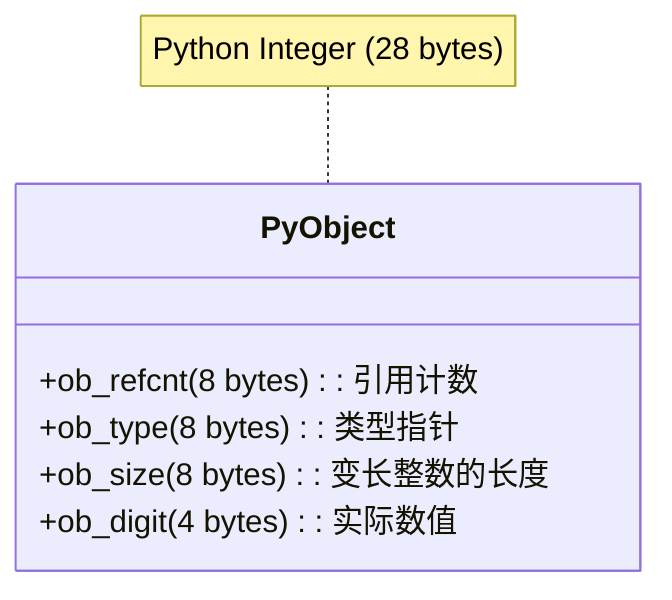
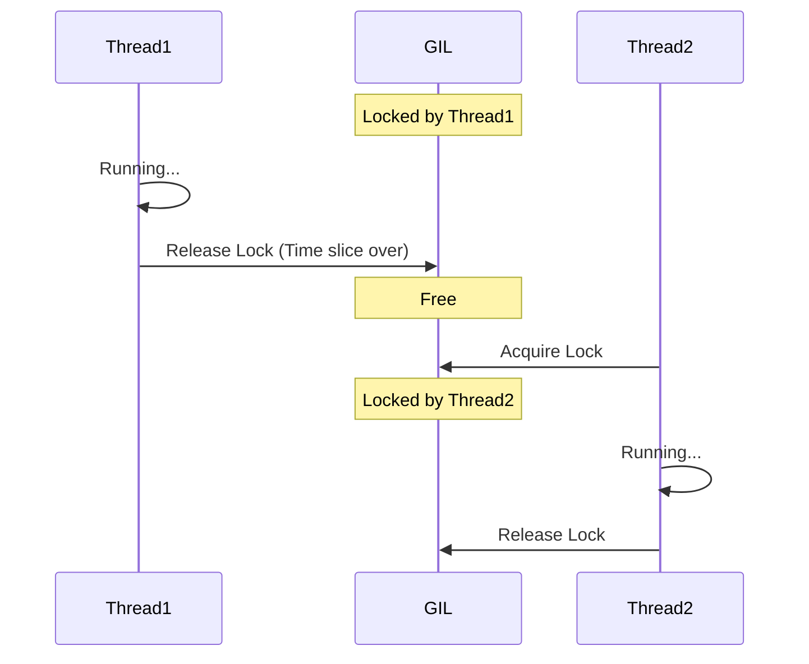
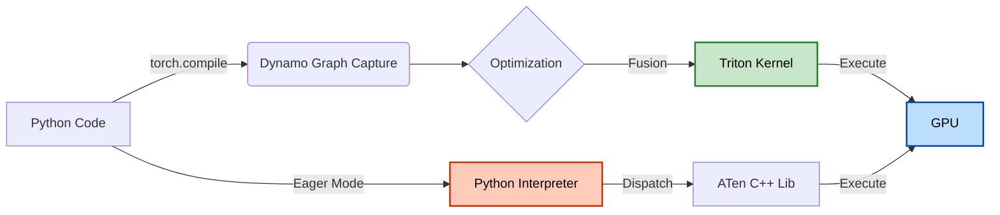

# 第 4 章：Python 的性能真相 (The Interpreter Overhead)

> **“Python 是第二好的语言——如果你想快速写出代码，它是最好的；如果你想让代码跑得快，它是最差的之一。”**

对于习惯了 C++ 或 Rust 的底层工程师来说，Python 简直是一场“灾难”：动态类型、解释执行、GIL（全局解释器锁）……每一个特性似乎都在向性能宣战。

但对于 AI 工程师来说，Python 是唯一的选择。为什么？因为我们并不真的用 Python 做计算。我们用 Python **指挥** C++ 和 CUDA 做计算。

本章将带你拆解 Python 解释器的物理开销，理解为什么简单的 `for` 循环会慢得令人发指，以及如何正确地使用 Python 这层“胶水”。

---

## 4.1 解释器与动态类型的代价

### 4.1.1 你的整数不是整数

在 C 语言中，一个 `int32` 就是内存中连续的 4 个字节（32 bit）。简单、纯粹。

但在 Python 中，当你写下 `a = 42` 时，发生的事情远比你想象的复杂。Python 的整数不仅仅是一个数字，它是一个 **对象 (PyObject)**。

让我们看看一个简单的整数在 Python 中占用了多少内存：

```python
import sys
x = 42
print(sys.getsizeof(x))
# 输出: 28 (在 64 位系统上)
```

**为什么是 28 字节？** 因为它包含了一个完整的 C 结构体：



*   **ob_refcnt**：引用计数，用于垃圾回收（GC）。
*   **ob_type**：指向 `int` 类型的指针，告诉解释器这是一个整数。
*   **ob_size**：因为 Python 整数是无限精度的（BigInt），需要记录长度。
*   **ob_digit**：终于到了，这里才真正存储了 `42` 这个数值。

**结论**：你在 Python 中每创建一个整数，就有 **75%** 以上的内存是“管理开销”。

### 4.1.2 解释器的循环开销

当你写一个简单的循环时：

```python
# Python loop
total = 0
for i in range(10_000_000):
    total += i
```

Python 解释器（CPython）在每一步都要做这些事：
1.  **取指**：获取下一条字节码。
2.  **类型检查**：检查 `total` 和 `i` 是什么类型？它们支持 `+` 运算吗？
3.  **解包 (Unboxing)**：从 `PyObject` 中取出实际的 C 整数。
4.  **运算**：调用底层的 C 加法。
5.  **装包 (Boxing)**：把结果重新封装成一个新的 `PyObject`。
6.  **GC 更新**：更新旧对象的引用计数，可能触发垃圾回收。

这就是为什么纯 Python 循环比 C 语言慢 **100 倍到 1000 倍** 的原因。

为了直观展示这种差距，我们对比了不同方式对 1000 万个整数求和的时间：


> **实测数据**：
> *   **纯 Python 循环**：~0.39s (基准)
> *   **内置 sum()**：~0.13s (3x Faster) —— 虽然是在 C 层面循环，但仍需处理 PyObject。
> *   **NumPy**：~0.0047s (**83x Faster**) —— 纯 C 数组，无 Boxing/Unboxing，SIMD 加速。
> *   **PyTorch**：~0.0084s (46x Faster) —— 同样是 C++/CUDA 后端。

---

## 4.2 全局解释器锁 (GIL)：多线程的谎言

很多初学者认为：“我的 CPU 有 64 个核，我开 64 个 Python 线程，速度就能快 64 倍！”

**大错特错。**

### 4.2.1 GIL 的物理机制

CPython 解释器的内存管理不是线程安全的。为了防止多线程同时修改同一个对象的引用计数（导致内存泄漏或崩溃），Python 引入了一把**超级大锁**：**Global Interpreter Lock (GIL)**。

**规则**：**在任何时刻，只有一个线程能持有 GIL 并在 CPU 上执行 Python 字节码。**

这就好比一个拥有 64 个灶台（CPU 核）的厨房，但只有 **一把菜刀**（GIL）。
*   即使你雇了 64 个厨师（线程），他们也得排队抢那把菜刀。
*   拿到菜刀的厨师切两下（执行 100 个字节码），就得被迫放下菜刀（释放 GIL），让别人用。



### 4.2.2 什么时候多线程有用？

GIL 锁住的是 **CPU 执行指令**。如果你的任务不需要 CPU（比如等待网络请求、读写磁盘），线程会主动释放 GIL。

*   **IO 密集型任务**（爬虫、Web 请求）：**多线程有用**。
    *   **为什么？** 当 Python 发起 I/O 请求（如读磁盘、发网络包）时，CPU 实际上只是给硬件（网卡、磁盘控制器）下达了指令，然后就“甩手”了。
    *   **谁在干活？** 真正的数据搬运由 **DMA (Direct Memory Access)** 控制器完成，不占用 CPU 时间。
    *   **结果**：CPU 在等待硬件传输数据期间是空闲的，因此 Python 会**主动释放 GIL**，让其他线程利用这段空闲时间执行代码。
*   **CPU 密集型任务**（矩阵乘法、图像处理）：**多线程没用**，甚至因为上下文切换变得更慢。

> **核心概念辨析：进程、线程与协程 (Async)**
>
> 1.  **进程 (Process)**：
>     *   **比喻**：独立的工厂。有自己独立的资源（内存、GIL）。
>     *   **优点**：真并行，完全绕过 GIL。
>     *   **缺点**：开销大，启动慢，通信（IPC）麻烦。
> 2.  **线程 (Thread)**：
>     *   **比喻**：工厂里的工人。共享工厂的资源（内存、GIL）。
>     *   **优点**：启动快，内存共享方便。
>     *   **缺点**：受 GIL 限制，CPU 密集型任务无法并行。
> 3.  **协程 (Async/Await)**：
>     *   **比喻**：一个超级高效的工人，做完A任务等待时（如等IO），立马切换去做B任务。
>     *   **本质**：单线程。**没有**并行，只有**并发**。
>     *   **适用**：高并发 IO（如处理 10000 个网络请求）。

**如何绕过 GIL？**
1.  **多进程 (Multiprocessing)**：每个进程有独立的解释器和 GIL。但代价是进程间通信（IPC）开销大，数据需要序列化（Pickle）。
2.  **C++ 扩展**：NumPy 和 PyTorch 的底层 C++ 代码在执行繁重计算时，会主动释放 GIL。

---

## 4.3 逃离解释器：C++ Extension 与 JIT

既然 Python 这么慢，为什么深度学习还用它？

因为我们**作弊**了。

### 4.3.1 Python 只是胶水

在 PyTorch 中，当你写 `c = a + b` 时，Python 解释器并没有做加法。它只是把“做加法”这个指令发给了底层的 C++ 引擎。

*   **Python 层**：负责 API 定义、自动微分图的构建、参数配置。开销 ~ms 级。
*   **C++/CUDA 层**：负责真正的矩阵运算。开销 ~s/min/hour 级。

只要计算量（运算时间）远大于 Python 的调度开销（调度时间），Python 的慢就不可感知。

### 4.3.2 Torch.compile 与 JIT

但在小算子很多的情况下（比如很多小的 `add`, `mul`, `relu`），Python 的调度开销就会累积变得显著。

PyTorch 2.0 引入了 `torch.compile`，这是一个 **JIT (Just-In-Time)** 编译器。

1.  **图捕获 (Graph Capture)**：它会把你的 Python 代码“看”一遍，把所有的操作记录成一个静态的计算图。
2.  **图优化 (Fusion)**：发现 `x * y + z`，它会将其融合为一个内核（Kernel），避免多次读写内存。
3.  **代码生成**：生成高效的 Triton 或 C++ 代码，完全绕过 Python 解释器执行。



*   **Eager Mode (默认)**：Python 逐行解释，逐个下发任务。灵活性高，但有 Python Overhead。
*   **Compiled Mode**：一次性生成优化后的机器码。丧失部分动态性，但性能接近原生 C++。

---

下一章，我们将深入 **第 5 章：张量的物理视图**，看看这些 C++ 扩展到底是如何在内存中组织数据的。
