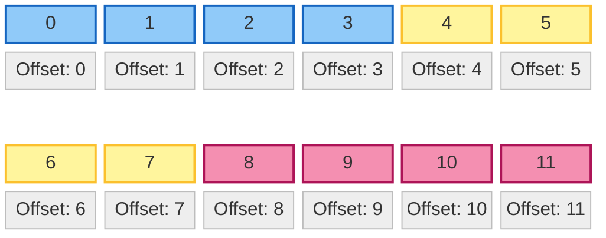

# 第 5 章：张量的物理视图 (The Physics of Tensors)

> **"A Tensor is a view of a Storage."**  
> —— PyTorch Internals

> **动手实验**：本章配套代码 [assets/tensor_internals.py](assets/tensor_internals.py) 可直接运行，直观展示 Stride、Storage 地址与 Broadcasting 的物理行为。

你在 Python 中看到的 `(3, 4, 5)` 维度的张量，其实是一个美丽的谎言。

在物理内存中，根本不存在“维度”这个概念。内存是一条长长的、一维的线性磁带。无论你的张量是 3 维、4 维还是 100 维，它们在底层的物理存储（Storage）里，都只是一串连续（或不连续）的数字。

本章将带你撕开维度的面纱，通过 **Stride (步长)** 和 **Storage (存储)** 这两个物理概念，彻底理解 PyTorch/NumPy 的底层魔法。

---

## 5.1 内存布局：维度只是幻觉 (Memory Layout)

### 5.1.1 什么是 Stride (步长)？

想象一下，你有一个 $3 \times 4$ 的矩阵 $A$：

$$
A = \begin{bmatrix}
0 & 1 & 2 & 3 \\
4 & 5 & 6 & 7 \\
8 & 9 & 10 & 11
\end{bmatrix}
$$

在物理内存中，这 12 个数字是这样排排坐的（假设是 **Row-major / C-Contiguous**）：

那么，当你访问 `A[1, 2]`（即数字 6）时，计算机怎么知道它在内存的哪个位置？

这就是 **Stride** 的作用。Stride 是一个数组，告诉计算机：**在某个维度上移动一步，物理内存中需要跳过多少个元素？**

对于这个 $3 \times 4$ 的矩阵：
1.  **第 0 维 (行)**：从第 0 行跳到第 1 行（如从 0 跳到 4），内存中需要跳过 **4** 个元素（整个一行的长度）。所以 `stride[0] = 4`。
2.  **第 1 维 (列)**：从第 0 列跳到第 1 列（如从 0 跳到 1），内存中需要跳过 **1** 个元素。所以 `stride[1] = 1`。

**寻址公式**：
$$
\text{Offset} = \text{index}_0 \times \text{stride}_0 + \text{index}_1 \times \text{stride}_1 + \dots
$$

验证一下 `A[1, 2]`：
$$
\text{Offset} = 1 \times 4 + 2 \times 1 = 6
$$
确实，数字 6 就躺在物理内存的第 6 个位置（从 0 开始数）。

### 5.1.2 零拷贝操作：View, Transpose 与 Permute

PyTorch 中最神奇的操作莫过于 `view`、`transpose` 和 `permute`。它们能在微秒级完成，即使张量有几个 G 那么大。

为什么？因为它们**根本没有复制数据**！它们只是修改了 **Stride** 和 **Shape** 这两个元数据（Metadata）。

#### 案例：转置 (Transpose)

当我们执行 `B = A.t()`（转置）时，逻辑上的 $B$ 变成了 $4 \times 3$：

$$
B = \begin{bmatrix}
0 & 4 & 8 \\
1 & 5 & 9 \\
\dots & \dots & \dots
\end{bmatrix}
$$

但在物理内存中，**数据纹丝不动**，还是 `0, 1, 2, 3, 4...`。
那是怎么变的？**改 Stride！**

*   `A.stride` 是 `(4, 1)`
*   `B.stride` 变成了 `(1, 4)`

验证 `B[1, 0]`（即原矩阵的 `A[0, 1]` = 1）：
$$
\text{Offset}_B = 1 \times \text{stride}_0 + 0 \times \text{stride}_1 = 1 \times 1 + 0 \times 4 = 1
$$
物理内存第 1 个位置确实是 **1**。

#### 陷阱：Contiguous (连续性)

虽然转置很快，但它产生了一个副作用：**内存不再连续了**。

*   **行优先 (Row-major / C-Contiguous)**：在一行内移动，内存是连续的。这是 PyTorch/C 的默认格式。
*   **列优先 (Col-major / F-Contiguous)**：在一列内移动，内存是连续的。这是 MATLAB/Fortran 的默认格式。

当你对一个转置后的张量执行 `view` 时，经常会报错：
`RuntimeError: view size is not compatible with input tensor's size and stride...`

**原因**：`view` 要求张量必须是 **C-Contiguous** 的，因为它假设可以通过重新计算 Stride 来映射形状。如果内存本身乱了，简单的数学变换就失效了。

**解决方法**：`.contiguous()`。
这个操作会**真的复制数据**，把内存重新排列成整齐的行优先顺序。

> **为什么 Contiguous 对性能至关重要？**
> 
> **CPU Cache Line**：CPU 读取内存不是一个字节一个字节读的，而是一次“抓”一块（通常 64 字节，即 16 个 float32）。
> *   **连续内存**：当你处理 `A[0, 0]` 时，CPU 顺手把 `A[0, 1]` 到 `A[0, 15]` 都抓进了 L1 Cache。接下来的计算就是极速的。
> *   **不连续内存**：如果 stride 很大（比如列优先访问行），每次访问 `A[0, 0]`, `A[0, 1]` 都需要跳跃到新的内存块，导致 **Cache Miss**，CPU 只能无奈地等待内存响应（慢 100 倍）。

> **性能启示**：
> 1.  尽量减少 `.contiguous()` 调用，因为它会触发内存拷贝（慢！）。
> 2.  但在将 Tensor 传给 CUDA Kernel 或 C++ 扩展前，通常必须保证它是 Contiguous 的。

---

## 5.2 广播机制：无中生有的艺术 (Broadcasting)

当你执行 `A + B` 时，如果 $A$ 是 $(3, 3)$，$B$ 是 $(1, 3)$，PyTorch 会自动把 $B$ “复制” 3 份变成 $(3, 3)$ 再相加。

这真的发生了内存复制吗？**没有**。

### 5.2.1 虚拟扩展 (Virtual Expansion)

广播的本质是将某一维度的 **Stride 设置为 0**。

假设 $B$ 是 `[10, 20, 30]`，形状 `(1, 3)`。物理内存里只有这 3 个数。
`stride` 是 `(3, 1)`（或者是 `(0, 1)`，取决于实现细节，但逻辑上相当于在第 0 维移动不消耗内存偏移）。

当我们把它广播成 $(3, 3)$ 时，逻辑上看是：
$$
\begin{bmatrix}
10 & 20 & 30 \\
10 & 20 & 30 \\
10 & 20 & 30
\end{bmatrix}
$$

但它的 **Stride** 变成了 `(0, 1)`！

验证访问 `B_broadcast[2, 1]`（应该是 20）：
$$
\text{Offset} = 2 \times 0 + 1 \times 1 = 1
$$
物理内存第 1 个位置确实是 **20**。

无论你在第 0 维怎么跳（第 1 行、第 2 行...），因为 stride 是 0，你永远在读物理内存里的同一行数据。

### 5.2.2 为什么要用广播？

1.  **省显存**：计算 Attention Matrix 时，如果直接把 mask 矩阵物理复制成 $B \times H \times S \times S$，显存可能瞬间爆炸。广播让你免费拥有了巨大的矩阵。
2.  **省带宽**：从内存读取数据的量更少了。CPU/GPU 只需要读一行数据，然后在寄存器里反复用，极大地提高了缓存命中率。

---

## 5.3 总结：从物理视角看 Tensor

| 操作 | 逻辑变化 | 物理数据 | Stride 变化 | 性能 |
| :--- | :--- | :--- | :--- | :--- |
| **View / Reshape** | 改变形状 | **不变** | 重新计算 | 极快 ($O(1)$) |
| **Transpose / Permute** | 交换维度 | **不变** | 交换顺序 | 极快 ($O(1)$) |
| **Slice (切片)** | 取子集 | **不变** | 仅仅改变 Offset 和 Stride | 极快 ($O(1)$) |
| **Broadcasting** | 扩展维度 | **不变** | 某维 Stride 设为 0 | 极快 ($O(1)$) |
| **Contiguous** | 无 (内存重排) | **复制重排** | 重置为标准行优先 | 慢 ($O(N)$) |

**下一章预告**：
既然我们知道了数据是如何在内存中“摆放”的，那么如何高效地把它们“喂”给 GPU 呢？第 6 章我们将深入 **数据流水线 (Data Pipeline)**，剖析 DataLoader 的多进程预取机制。

> **附：Expand vs Repeat**
> *   `a.expand(3, 3)`：**零拷贝**。仅仅修改 Stride 为 0。推荐使用。
> *   `a.repeat(1, 3)`：**深拷贝**。会在物理内存中真的把数据复制 3 份。尽量避免。
