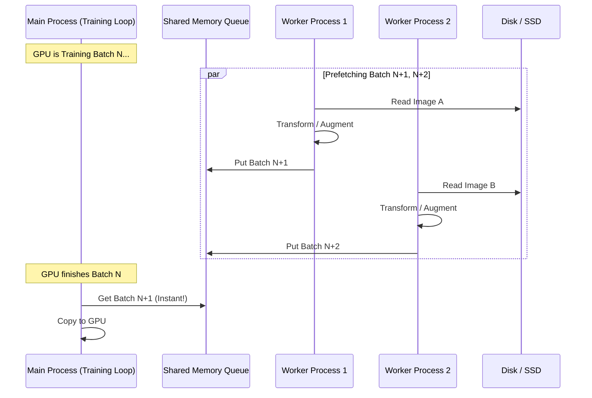
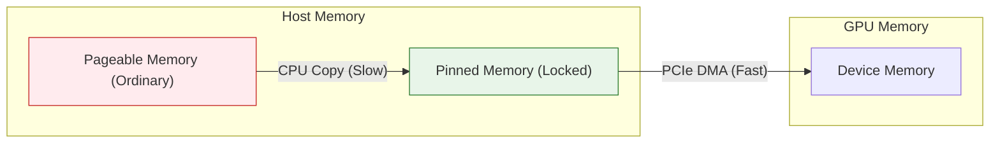
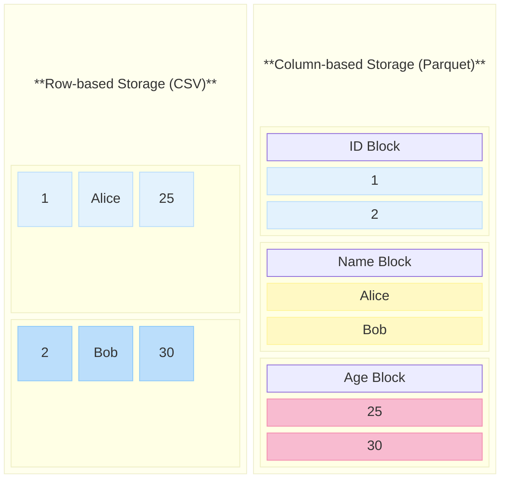

# 第 6 章：数据流水线与 I/O 优化 (Data Pipeline Optimization)

> **"CPU is the new bottleneck."**
> —— 在 GPU 越来越快的今天，喂数据的速度往往跟不上 GPU 吃数据的速度。

你是否遇到过这样的场景：买了一张 H800，训练模型时 GPU 利用率（Volatile GPU-Util）却只有 30%？
打开 `nvtop` 一看，GPU 经常在 0% 和 100% 之间跳变（锯齿状波动）。

这通常不是 GPU 的问题，而是 **I/O 瓶颈**。你的 GPU 就像一个饥饿的法拉利引擎，而你的 DataLoader 就像是用吸管在给它喂油。

本章将深入 PyTorch DataLoader 的内部机制，教你如何打造一条能喂饱 GPU 的高速数据流水线。

---

## 6.1 PyTorch DataLoader 深度解析

### 6.1.1 核心机制：多进程预取 (Multi-process Prefetching)

Python 的 GIL 锁导致单线程无法利用多核 CPU 进行并行数据处理。PyTorch 的 `DataLoader` 通过 `num_workers > 0` 开启多进程模式来绕过这个问题。

**工作流程图解**：



*   **num_workers=0**：主进程自己干活。读磁盘 -> 处理 -> 训练 -> 读磁盘... 串行执行，慢！
*   **num_workers=N**：N 个工人提前在后台读数据、做 Augmentation，并把处理好的 Batch 放到内存队列里。主进程取数据时，数据已经准备好了。

> **最佳实践**：`num_workers` 设置为 CPU 核心数（或核心数/GPU数）。设置过大反而会增加进程切换开销和内存占用。

### 6.1.2 锁页内存 (Pin Memory)

从 CPU 内存（Host）传输数据到 GPU 显存（Device）时，数据必须先被拷贝到一块“锁页内存”（Page-locked / Pinned Memory）中，然后才能通过 PCIe 总线传输。

*   **pin_memory=False**（默认）：
    1.  数据在普通的可分页内存（Pageable Memory）。
    2.  驱动程序隐式分配一块临时的锁页内存。
    3.  CPU 将数据从可分页内存 **拷贝** 到临时锁页内存。
    4.  GPU 通过 DMA 从锁页内存读取数据。

*   **pin_memory=True**：
    1.  DataLoader 直接把数据分配在锁页内存中。
    2.  GPU 直接通过 DMA 读取数据。**少了一次 CPU 拷贝！**



> **结论**：在 DataLoader 中永远开启 `pin_memory=True`，除非你的内存非常吃紧。

### 6.1.3 Collate_fn：被忽视的瓶颈

`collate_fn` 负责将多个样本（List of Tensors）拼接成一个 Batch（Tensor）。
如果你的样本包含变长数据（如文本、音频），或者有复杂的自定义逻辑，`collate_fn` 可能会在主进程（或 Worker 进程）中消耗大量时间。

---

## 6.2 高性能文件格式与数据表示

选择正确的文件格式，能让 I/O 速度提升 10 倍以上。

### 6.2.1 文本与扁平数据：CSV/JSON/JSONL 

*   **CSV**：
    *   **优点**：体积小，Excel 可打开，通用性强。
    *   **缺点**：不支持嵌套结构；解析需要字符串分割，速度中等。
*   **JSON**：
    *   **优点**：支持复杂嵌套结构，Web API 标准格式。
    *   **缺点**：**内存杀手**。标准 JSON 文件通常是一个巨大的列表 `[...]`。解析器（Parser）为了验证 JSON 的合法性（匹配首尾括号），往往需要把整个文件加载到内存中。
    *   **场景**：如果你的数据集有 100GB，用 JSON 存，读取时内存直接爆炸（OOM）。
    
    ```json
    // data.json: 整个文件是一个巨大的 Array
    [
      {"id": 1, "content": "第一条数据..."},
      {"id": 2, "content": "第二条数据..."},
      // ... 还要读到第 1000 万行才能遇到 "]"
    ]
    ```

*   **JSONL (JSON Lines)**：
    *   **优点**：**流式读取 (Streaming Friendly)**。每一行都是一个独立的、合法的 JSON 对象。读取程序不需要看文件的结尾，读一行就能用一行。
    *   **场景**：100GB 的文件，内存占用仅需几 KB（一行的大小）。支持断点续训（记录读到了第几行即可）。
    
    ```json
    // data.jsonl: 每一行相互独立，没有逗号，没有外层 []
    {"id": 1, "content": "第一条数据..."}
    {"id": 2, "content": "第二条数据..."}
    // 读完这一行，内存就可以释放，立刻读下一行
    ```

### 6.2.2 列式存储：Parquet / Arrow

对于表格型数据（如推荐系统的特征），Parquet 和 Arrow 是神一般的存在。二者经常成对出现，但定位不同：
*   **Parquet**：**磁盘**上的存储格式（面向空间压缩优化）。
*   **Arrow**：**内存**中的数据格式（面向 CPU SIMD 计算优化）。

#### 1. Parquet 的列式存储原理 (Disk Optimization)

*   **行式存储 (Row-based, e.g., CSV/JSONL)**：数据按行物理存储。读取“年龄”这一列时，必须扫描整行数据（包括你不需要的“姓名”、“ID”等）。
*   **列式存储 (Column-based, e.g., Parquet)**：数据按列物理存储。读取“年龄”这一列时，**只读取该列的物理块**，完全跳过其他列。

**存储结构对比图解**：

假设我们有如下数据表：

| ID | Name | Age |
| :--- | :--- | :--- |
| 1 | Alice | 25 |
| 2 | Bob | 30 |



*   **列式存储优势**：如果你只训练 `Age` 列，Parquet 允许你**只读取粉色块 (Age Block)**，忽略蓝色 (ID) 和黄色 (Name) 块。I/O 量瞬间降低 66%。
*   **压缩率**：同一列的数据类型相同（如 Age 都是整数），压缩效果极佳（Snappy / Zstd）。

#### 2. Apache Arrow：零拷贝的高速公路 (Memory Optimization)

当我们将 Parquet 文件读入内存（如 Pandas 或 PyTorch）时，传统流程需要进行**序列化/反序列化 (SerDe)**，这是巨大的 CPU 开销。

Arrow 定义了一种**标准化的内存格式**。无论你是 Python (Pandas)、C++、Java 还是 Spark，只要大家都遵守 Arrow 内存规范：
1.  **零拷贝 (Zero-Copy)**：从 Spark 传数据给 Pandas，或者从 Pandas 传给 PyTorch，不需要复制内存，直接传递指针即可。
2.  **SIMD 友好**：Arrow 的内存布局是紧凑对齐的，CPU 可以直接用 SIMD 指令（如 AVX-512）对一整列数据进行并行计算。

> **HuggingFace Datasets 的秘密**：
> HuggingFace 的 `datasets` 库底层完全基于 Arrow。当你加载一个 100GB 的数据集时，它并没有把数据读进 Python 的 Heap 内存，而是通过 `mmap` 将 Arrow 格式的文件映射到内存。
> 这就是为什么你能在 8GB 内存的笔记本上加载 1TB 的数据集，并且索引速度极快。

### 6.2.3 科学计算容器：HDF5 / NPY

这两个格式是科学计算（Scientific Computing）领域的“硬盘”。它们不关心“表格”或“列”，它们只关心一个东西：**多维数组 (N-dimensional Arrays)**。

*   **NPY (.npy / .npz)**：
    *   **本质**：它是 NumPy 内存数组的“快照”。把内存里的二进制数据（C-Array）直接 Dump 到磁盘上，加上一个简单的 Header 告诉 NumPy 数据类型和形状。
    *   **极速读取**：读取 `.npy` 文件时，几乎等于磁盘的顺序读取速度（Sequential Read）。
    *   **局限**：`.npy` 只能存一个数组；`.npz` 是多个 `.npy` 的 Zip 压缩包，不支持部分读取（必须解压）。

*   **HDF5 (Hierarchical Data Format)**：
    *   **本质**：**文件系统中的文件系统**。你可以在一个 `.h5` 文件里创建文件夹（Groups）和文件（Datasets）。
    *   **切片读取 (Slicing)**：这是 HDF5 的杀手锏。假设你有一个 1TB 的数组 `data[1000000, 1024]` 存在磁盘上。
        *   用 NPY：你需要把 1TB 读进内存才能访问 `data[0]`。
        *   用 HDF5：你可以只执行 `x = f['data'][0:10]`。HDF5 只会从磁盘读取这 10 行数据对应的字节，**内存占用极小，速度极快**。

### 6.2.4 安全与速度的新星：Safetensors

HuggingFace 推出的新格式，正在全面取代 PyTorch 默认的 Pickle (`.bin` / `.pth`)。

#### 1. Pickle 的“任意代码执行”漏洞
PyTorch 的 `torch.load()` 默认使用 Python 的 `pickle` 模块。Pickle 不仅仅是存数据，它还能存“指令”。
如果里面隐藏了危险代码，当你加载这个模型时，这行代码就会执行！造成严重后果。
```python
import os; os.system("rm -rf /") 
```
这就是为什么现在的 Model Hub 都会标记 "Pickle Scanning" 状态。

#### 2. Safetensors 的极致优化
Safetensors 是一个**纯粹的数据容器**，它只有两个部分：
1.  **Header (JSON)**：告诉程序每个 Tensor 的名字、Shape、Dtype 以及在文件中的**字节偏移量 (Offset)**。
2.  **Body (Raw Bytes)**：紧接着 Header，存储纯粹的二进制 Tensor 数据。

**零拷贝 (Zero-copy) 与 mmap**：
当你加载一个 100GB 的 Safetensors 模型时：
```python
from safetensors.torch import load_file
# 这一步瞬间完成，不消耗 100GB 内存！
state_dict = load_file("model.safetensors") 
```
操作系统使用 **mmap (内存映射)** 技术，把磁盘文件“映射”到虚拟内存地址空间。
*   **物理内存**：此时可能只占用了几 MB（存 Header）。
*   **按需加载**：当你真正进行 `layer1.weight + x` 计算时，CPU 触发“缺页中断 (Page Fault)”，操作系统才会把 `layer1.weight` 对应的磁盘数据搬进物理内存。

> **对比**：加载 Pickle 文件时，Python 必须把整个文件读入内存，解析成对象，不仅慢，而且内存瞬间爆炸（峰值内存通常是文件大小的 2 倍以上）。

---

## 6.3 Linux 系统的 I/O 机制

### 6.3.1 Page Cache：操作系统的神助攻

你是否发现，同一个数据集，第一遍训练很慢，第二遍突然变快了？
这不是玄学，是 Linux 的 **Page Cache**。

Linux 会把空闲的内存用作文件缓存。当你读取文件时，Linux 会悄悄把它留在内存里。下次再读，直接从内存拿，速度从 SSD 的 500MB/s 飙升到内存的 50GB/s。

> **启示**：买大内存！如果你的内存能装下整个数据集，训练速度将起飞。

### 6.3.2 DMA (Direct Memory Access)

在没有 DMA 的年代，硬盘读数据到内存，需要 CPU 亲自搬运每一个字节。CPU 累得要死，没空干别的。

有了 DMA（直接内存访问），CPU 只需要发号施令：“硬盘，把这 1GB 数据搬到内存地址 X，搬完了叫我。”
然后 CPU 就可以去算梯度了。硬盘和内存之间自己建立通道传输数据。

**Pin Memory** 的核心原理，就是为了配合 DMA，确保数据在传输过程中地址不会变（不会被操作系统换页到 Swap）。

---

## 6.4 总结：打造 I/O 及其流水线

1.  **格式选择**：大模型语料用 **JSONL** 或 **Parquet**；图像/视频尽量存成打包格式（如 WebDataset）避免百万级小文件。
2.  **DataLoader**：
    *   `num_workers = CPU Cores`
    *   `pin_memory = True`
    *   `prefetch_factor = 2`
3.  **硬件**：把数据集放在 NVMe SSD 上，不要用机械硬盘。
4.  **系统**：利用好 Page Cache，甚至使用 `vmtouch` 工具强制把数据集锁在内存里。

**下一章预告**：
数据准备好了，计算核心也理解了。接下来我们将进入最硬核的部分——**GPU 编程与算子优化**。你将看到 CUDA 核心是如何被调度的，以及为什么写好一个算子比写好模型更难。
