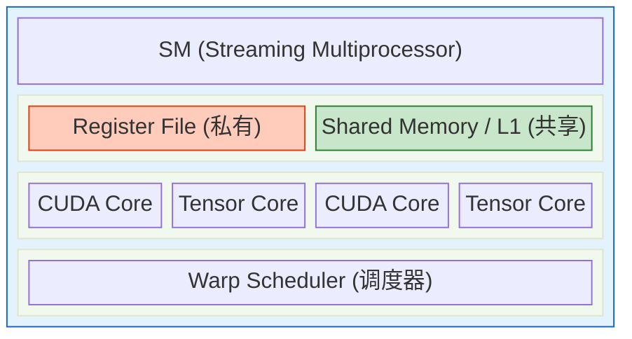
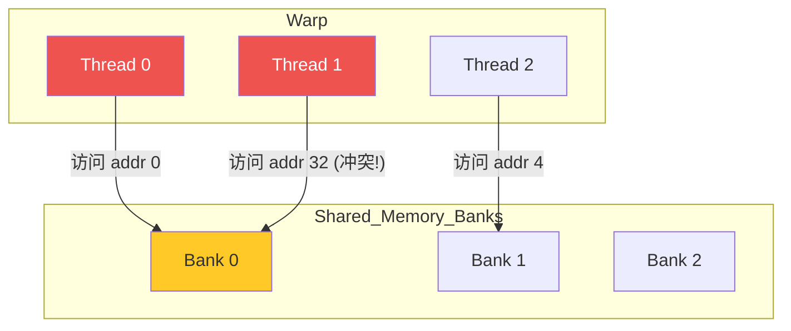

# 第 7 章：GPU 架构深度解析 (Deep Dive into GPU)

> **"Latency is the new throughput."**  
> (在 GPU 编程中，掩盖延迟是获得高吞吐量的唯一途径。)

在第 2 章中，我们简单地将 GPU 描述为一个“吞吐量怪兽”。但当你真正开始优化深度学习算子（Operator）时，你会发现这个怪兽的脾气非常古怪。

为什么把 `Batch Size` 从 31 改成 32，性能会突然翻倍？  
为什么写同样逻辑的 Triton / CUDA 代码，只是改变了数据读取顺序，速度就差了 10 倍？  
为什么显存明明还有空余，GPU 利用率却只有 30%？

本章将带你深入 GPU 的微观世界——**SM (Streaming Multiprocessor)**。我们将不再把 GPU 看作一个黑盒，而是拆解它的流水线，理解**寄存器 (Register)**、**共享内存 (Shared Memory)** 和 **线程 (Thread)** 之间微妙的平衡关系。

对于习惯了数学推导的你，这一章的挑战在于：**你需要开始思考“空间布局”和“资源竞争”**。

---

## 7.1 SM (Streaming Multiprocessor)：GPU 的心脏

如果说 GPU 是一个大型工厂，那么 SM 就是工厂里的“车间”。NVIDIA H100 GPU 拥有 132 个 SM。

一个 SM 内部并不是只有计算单元（CUDA Cores / Tensor Cores），它更像是一个自给自足的小型 CPU，拥有自己的调度器、寄存器堆和缓存。

### 7.1.1 资源分配：寸土寸金的 Shared Memory 与 Register

在 GPU 编程中，最稀缺的资源不是算力，而是**片上存储 (On-chip Memory)**。

#### 1. 寄存器文件 (Register File) —— 最快的私有空间
*   **数学视角**：函数的局部变量。
*   **物理视角**：每个 SM 拥有海量的寄存器（例如 H100 每个 SM 有 64K 个 32-bit 寄存器）。
*   **关键限制**：寄存器是分配给**每个线程 (Thread)** 私有的。如果你在一个 Kernel 函数里定义了太多局部变量（比如 `float a, b, c, d...`），每个线程就会消耗更多的寄存器。
*   **后果**：当每个线程消耗的寄存器过多时，SM 就不得不减少同时运行的线程数量（因为总寄存器数是固定的）。这会导致 **Occupancy (占用率)** 下降。

#### 2. 共享内存 (Shared Memory / SRAM) —— 线程间的数据交换站
*   **数学视角**：分块矩阵乘法中的 $A_{block}, B_{block}$ 缓冲区。
*   **物理视角**：这是 GPU 上唯一可编程的高速缓存（L1 Cache）。它的速度极快（带宽 ~几十 TB/s），但容量极小（通常每个 SM 只有 100KB~200KB）。
*   **用途**：它是 FlashAttention 等算子性能起飞的关键——把数据从 HBM 搬到 SRAM，算完再写回，避免反复访问 HBM。

### 7.1.2 Occupancy (占用率)：如何让工人不偷懒？

**Occupancy** 是衡量 GPU 效率的核心指标。

$$ \text{Occupancy} = \frac{\text{Active Warps}}{\text{Maximum Warps per SM}} $$

*   **Warp (线程束)**：32 个线程组成的最小执行单元。
*   **延迟掩盖 (Latency Hiding)**：GPU 没有任何分支预测或乱序执行机制。当一个 Warp 执行 `x = Memory[i]`（需要等待 200 个周期）时，SM 会**立刻**切换到另一个准备好的 Warp 继续执行。
*   **核心逻辑**：为了掩盖内存延迟，我们需要**足够多的 Warp** 轮流上岗。

**资源限制导致的 Occupancy 下降案例**：
假设 H100 的一个 SM 最多能跑 2048 个线程。
*   **情况 A**：你的 Kernel 很简单，每个线程只用 32 个寄存器。
    *   $\text{Total Registers} = 2048 \times 32 = 64K$。刚好用完 SM 的寄存器堆。
    *   **结果**：可以跑满 2048 个线程，Occupancy = 100%。
*   **情况 B**：你的 Kernel 写得很复杂，每个线程用了 255 个寄存器。
    *   $\text{Max Threads} = 64K / 255 \approx 256$。
    *   **结果**：只能跑 256 个线程，Occupancy = 12.5%。
    *   **后果**：当这 256 个线程都在等内存时，SM 就只能空转，性能暴跌。

> **优化心法**：**Register Pressure (寄存器压力)** 是书写高性能 Kernel 的大敌。有时我们宁愿多算几次（Re-computation），也不愿多存几个中间变量。

---

## 7.2 显存访问模式 (Memory Access Patterns)

在第 1 章我们提到 HBM 是瓶颈。在这一节，我们将看到，**不仅读多少很重要，怎么读更重要**。

### 7.2.1 Coalesced Access (合并访问) —— 为什么对齐如此重要？

GPU 的内存控制器（Memory Controller）是一次性读取一块连续内存（Transaction），通常是 32 字节或 128 字节。

想象一下，一个 Warp 有 32 个线程，它们同时发起读内存请求：

*   **合并访问 (Coalesced)**：
    *   Thread 0 读 `addr[0]`
    *   Thread 1 读 `addr[1]`
    *   ...
    *   Thread 31 读 `addr[31]`
    *   **结果**：这 32 个地址是**连续**的。内存控制器只需发射 **1 个** Transaction 就能把数据全部取回来。**效率 100%**。

*   **非合并访问 (Uncoalesced)**：
    *   Thread 0 读 `addr[0]`
    *   Thread 1 读 `addr[100]`
    *   ...
    *   **结果**：地址是**散乱**的。内存控制器不得不发射 **32 个** Transaction，每个只为了拿这 128 字节中的 4 个字节。
    *   **效率**：$1/32 \approx 3\%$。**带宽浪费了 97%！**

> **Python 代码映射**：
> 这就是为什么 `permute` 或 `transpose` 之后的 Tensor 如果不调用 `.contiguous()`，直接进行某些操作可能会变慢。虽然 PyTorch 底层会自动处理，但在编写自定义 CUDA/Triton 算子时，这是由于数据在物理内存中不再连续导致的。
>
> **Row-major vs Col-major**：在 C/Python (Row-major) 中，遍历行 (`A[i, :]`) 是连续的，遍历列 (`A[:, j]`) 是跳跃的。在 GPU 上，一定要让线程 ID (`threadIdx.x`) 对应连续的内存地址。

### 7.2.2 Bank Conflict (存储体冲突) —— Shared Memory 的交通堵塞

Shared Memory 被划分为 32 个 **Bank (存储体)**，就像银行有 32 个柜台。每个 Bank 每个周期只能服务一个请求。

*   **理想情况**：Warp 中的 32 个线程，分别访问 32 个不同的 Bank。
    *   Thread 0 -> Bank 0
    *   Thread 1 -> Bank 1
    *   **耗时**：1 个周期。

*   **冲突情况 (Conflict)**：多个线程试图访问同一个 Bank 的不同地址。
    *   Thread 0 -> Bank 0 (地址 0)
    *   Thread 1 -> Bank 0 (地址 32)
    *   **后果**：银行柜台处理不过来，必须**串行化 (Serialization)**。Thread 1 必须等 Thread 0 办完业务。
    *   **耗时**：2 个周期（如果是 2 路冲突）。严重时会增加几十倍延迟。

**图解 Bank Conflict**：

> **常见场景**：
> 在实现矩阵乘法 Tiling 或 FFT 时，经常需要以特定的 `Stride` 访问 Shared Memory。如果 `Stride` 恰好是 32 的倍数，就会导致所有线程都挤到 Bank 0，造成严重的 Bank Conflict。
>
> **解决方法**：**Padding (填充)**。
> 申请 Shared Memory 时，不要申请 `[32][32]`，而是申请 `[32][33]`。多出来的这一列不存数据，专门用来错位，让列访问也能打散到不同的 Bank。

---

## 7.3 总结：GPU 编程的思维转换

从 CPU 到 GPU，你需要完成以下思维转换：

1.  **从“逻辑流”到“数据流”**：不要盯着 `if-else`，要盯着数据在内存里的布局。
2.  **从“低延迟”到“高吞吐”**：不要担心单个线程跑得慢，要担心是否有足够的线程（Occupancy）来掩盖延迟。
3.  **对齐与连续**：这是 GPU 性能的生命线。无论是 HBM 的 Coalesced Access 还是 Shared Memory 的 Bank Conflict，本质都是为了让并行的数据通路畅通无阻。

**下一章预告**：
理解了硬件架构后，我们该如何描述计算任务？下一章我们将探讨 **计算图 (Computational Graph) 与自动微分**，看看 PyTorch 是如何把你的数学公式翻译成 GPU 能听懂的 DAG（有向无环图）的。
