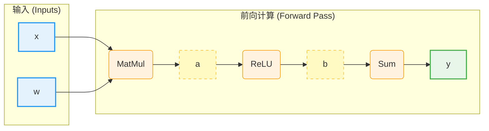
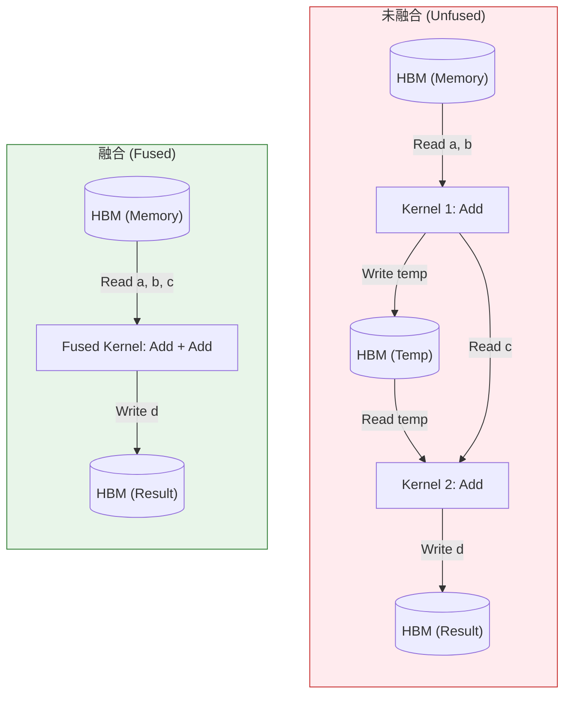

# 第 8 章：计算图与自动微分 (Computational Graph)

> **"Autograd is the engine of Deep Learning, but it eats your memory for breakfast."**

如果说 GPU 是“肌肉”，那么计算图就是深度学习框架的“神经系统”。

对于数学背景的同学来说，**链式法则 (Chain Rule)** 就像呼吸一样自然：
$$ \frac{\partial z}{\partial x} = \frac{\partial z}{\partial y} \cdot \frac{\partial y}{\partial x} $$

但在计算机系统里，实现链式法则并不是免费的。为了计算梯度，我们必须付出巨大的代价——**显存 (VRAM)**。

为什么训练时的显存占用通常是推理时的 3-4 倍？  
为什么简单的 `x + y + z` 操作在 GPU 上可能比矩阵乘法还慢？  
为什么 FlashAttention 不需要存储 $N \times N$ 的 Attention Matrix 就能算出正确的梯度？

本章将带你深入 PyTorch 的 Autograd 引擎内部，揭示计算图背后的物理开销。

---

## 8.1 Autograd 的物理代价

### 8.1.1 动态图 (Dynamic Graph) 与 DAG

PyTorch 采用的是**动态图 (Define-by-Run)** 机制。当你执行前向传播 (Forward) 代码时，PyTorch 会在后台悄悄构建一张 **DAG (有向无环图)**。

```python
import torch

x = torch.randn(1024, 1024, requires_grad=True, device='cuda')
w = torch.randn(1024, 1024, requires_grad=True, device='cuda')

# 前向传播
a = torch.mm(x, w)  # Node 1: MatMul
b = torch.relu(a)   # Node 2: ReLU
y = b.sum()         # Node 3: Sum

# 反向传播
y.backward()
```

在这个过程中，PyTorch 做了两件事：
1.  **执行计算**：调用 CUDA Kernel 算出 `a`, `b`, `y` 的数值。
2.  **构建图**：记录下 `b` 是由 `a` 经过 `ReLU` 得到的，`a` 是由 `x` 和 `w` 经过 `MatMul` 得到的。



### 8.1.2 显存杀手：中间激活值 (Activations)

为了计算梯度，Autograd 必须保存前向传播时的某些中间结果。这些被保存的 Tensor 称为 **Saved Tensors** 或 **Activations**。

让我们看一个简单的数学例子：
$$ y = f(x) = \sigma(x) = \frac{1}{1 + e^{-x}} $$
其导数为：
$$ f'(x) = f(x) \cdot (1 - f(x)) = y \cdot (1 - y) $$

**关键点**：为了计算 $x$ 的梯度，你需要知道 $y$ 的值！

在 PyTorch 中，这意味着在前向传播结束后，尽管 `y` 已经算出来了，但它**不能被释放**，必须一直驻留在显存中，直到反向传播结束。

> **显存占用公式**：
> $$ \text{Training Memory} \approx \text{Model Weights} + \text{Optimizer States} + \text{Activations} + \text{Gradients} $$
>
> 让我们来逐项拆解这个公式。假设我们有一个 **7B (70亿参数)** 的模型（如 LLaMA-7B），使用 **AdamW** 优化器，在 **FP16** 混合精度下训练。
>
> #### 1. Model Weights (模型参数)
> 这是模型本身的静态大小。
> *   **FP16 精度**：每个参数占 2 Bytes。
> *   **占用**：$7 \times 10^9 \times 2 \text{ Bytes} \approx \mathbf{14 \text{ GB}}$。
> *   *注：这只是推理时的占用。训练时远不止于此。*
>
> #### 2. Gradients (梯度)
> 在反向传播中，我们需要为每个参数计算一个梯度值。
> *   **FP16 精度**：梯度通常与参数同精度，也是 2 Bytes。
> *   **占用**：$7 \times 10^9 \times 2 \text{ Bytes} \approx \mathbf{14 \text{ GB}}$。
>
> #### 3. Optimizer States (优化器状态)
> 这是被很多人忽视的**显存大户**。AdamW 优化器需要为每个参数维护两个动量：一阶动量 (Momentum) 和二阶动量 (Variance)。
> *   为了保持精度，优化器状态通常以 **FP32 (4 Bytes)** 存储，即使模型参数是 FP16。
> *   **Momentum (FP32)**：$7 \times 10^9 \times 4 \text{ Bytes} \approx 28 \text{ GB}$。
> *   **Variance (FP32)**：$7 \times 10^9 \times 4 \text{ Bytes} \approx 28 \text{ GB}$。
> *   **Master Weights (FP32)**：为了避免 FP16 更新时的精度丢失，混合精度训练通常还会维护一份 FP32 的参数副本。$7 \times 10^9 \times 4 \text{ Bytes} \approx 28 \text{ GB}$。
> *   **总占用**：$28 + 28 + 28 = \mathbf{84 \text{ GB}}$！
> *   *结论：仅优化器状态就是模型权重的 6 倍！这就是为什么 ZeRO 优化器如此重要。*
>
> #### 4. Activations (中间激活值)
> 这是最不可控的部分，它取决于 **Batch Size** 和 **Sequence Length**。
> *   对于 Transformer，每层的 Self-Attention 和 MLP 的输入都需要保存。
> *   假设 Batch Size = 1, Sequence Length = 4096, Hidden Size = 4096, Layers = 32。
> *   粗略估算，仅仅保存每层的输入就需要几个 GB。如果 Batch Size 增大到 32 或 64，**Activations 将轻易超过 100 GB**，瞬间撑爆 A100 (80GB)。
> *   *解决之道：Activation Checkpointing (重计算) 或 FlashAttention。*

---

## 8.2 算子融合 (Operator Fusion)：减少显存读写

我们在第 1 章学过：**数据搬运是昂贵的，计算是廉价的**。
我们在第 7 章学过：**启动一个 CUDA Kernel 是有开销的**。

### 8.2.1 什么是 Operator (算子)？

在深度学习框架中，我们每天都在调用的 `torch.mm`, `torch.relu`, `torch.nn.Conv2d` 统称为 **Operator (算子)**。

*   **定义**：算子是构建计算图的基本单元，它定义了从输入 Tensor 到输出 Tensor 的数学变换。
*   **角色**：它是逻辑上的抽象。当我们写 `y = x + 1` 时，我们是在计算图中添加了一个 `Add` 算子。

> **⚠️ 统计学背景提示：此 Operator 非彼 Operator**
> *   在泛函分析中，Operator (算子) 通常指将函数映射到函数的变换（如微分算子 $\frac{d}{dx}$、积分算子）。
> *   在深度学习工程中，Operator 仅仅指**“执行某种数学运算的函数单元”**（如矩阵乘法、卷积）。

### 8.2.2 什么是 Kernel (内核函数)？

在深入讨论融合之前，我们需要先搞清楚一个核心概念：**Kernel**。

*   **定义**：Kernel 是在 GPU 上并行执行的函数。当你调用 `torch.add(a, b)` 时，PyTorch 实际上是在 GPU 上启动了一个名为 `add_kernel` 的程序。
*   **类比**：
    *   **CPU (经理)**：负责复杂的逻辑控制（发号施令）。
    *   **GPU (工厂)**：拥有成千上万个工人（CUDA Cores），负责执行具体的重复劳动。
    *   **Kernel (工单)**：经理发给工人的具体指令单。比如：“每个人把左手的数据和右手的数据相加，结果写在纸上。”
*   **Kernel Launch (启动)**：
    *   这就是“经理给工厂打电话下指令”的过程。
    *   **开销**：每次打电话（CPU 通知 GPU 启动 Kernel）都需要时间，大约 **几微秒 (us)**。
    *   **问题**：如果你的任务只是“做一次加法”（计算量极小），那么打电话的时间可能比做加法的时间还长！这就好比经理打个电话只为了让工人拧一颗螺丝，效率极低。

> **⚠️ 统计学背景提示：此 Kernel 非彼 Kernel**
> *   在统计学习（如 SVM、高斯过程）中，Kernel (核函数) 指的是 $K(x, y) = \langle \phi(x), \phi(y) \rangle$，用于将数据映射到高维空间以计算内积。
> *   在计算机系统（CUDA/OpenCL）中，Kernel 指的是**“在设备上执行的并行函数”** (Compute Kernel)。
> *   本书中除非特别说明，Kernel 均指 GPU 上的计算函数。

### 8.2.3 关键区别：Operator vs Kernel

很多初学者容易混淆这两个概念，认为一个算子就对应一个 Kernel。其实不然。

*   **Operator (算子) 是“做什么” (What)**：它是逻辑层面的指令。比如“做一次矩阵乘法”。
*   **Kernel (内核) 是“怎么做” (How)**：它是物理层面的实现。比如“用 128x128 的分块策略，在 Volta 架构上执行矩阵乘法”。

**它们的关系是多对多的**：

1.  **1 Operator -> N Kernels**：
    *   当你调用 `torch.mm` 时，PyTorch 会根据你的 GPU 型号（V100 vs A100）和矩阵大小，在底层选择一个**最合适**的 Kernel 来执行。
2.  **N Operators -> 1 Kernel**：
    *   这就是我们马上要讲的**算子融合**。`Conv2d` + `ReLU` + `Add` 三个逻辑算子，可以被编译成一个物理 Kernel 一次性跑完。

### 8.2.4 为什么 `x + y + z` 很慢？

考虑以下 PyTorch 代码：
```python
d = a + b + c
```
直觉上这很快。但在未优化的 GPU 上，它会触发 **3 次 Kernel Launch** 和 **3 次显存读写**：

1.  **Kernel 1**: 读 `a`, `b` -> 计算 `temp = a + b` -> 写 `temp` 回 HBM。
2.  **Kernel 2**: 读 `temp`, `c` -> 计算 `d = temp + c` -> 写 `d` 回 HBM。

**问题**：
*   `temp` 是一个中间变量，写回 HBM 再读回来完全是浪费带宽。
*   每个 Kernel 启动需要几个微秒 (us)，对于小 Tensor，启动时间甚至比计算时间还长。

### 8.2.5 融合 (Fusion) 的魔力

**算子融合 (Operator Fusion)** 就是把多个简单的数学运算“熔合”成一个大的 CUDA Kernel。

在融合后：
1.  **Kernel Fused**: 读 `a`, `b`, `c` -> 寄存器中计算 `acc = a + b; res = acc + c` -> 写 `d` 回 HBM。

**收益**：
*   **显存带宽**：减少了 `temp` 的读写。
*   **Kernel 开销**：3 次启动变为 1 次启动。

> **常见融合模式**：
> *   **Conv + ReLU + BatchNorm**：这是 CNN 里的标配。
> *   **Linear + GELU**：Transformer 里的标配。
> *   **Softmax**：通常会将 `max`, `sub`, `exp`, `sum`, `div` 融合在一起。



---

## 8.3 FlashAttention：打破 $O(N^2)$ 的内存墙

Transformer 中最耗显存的组件是 Self-Attention：
$$ \text{Attention}(Q, K, V) = \text{softmax}\left(\frac{QK^T}{\sqrt{d_k}}\right)V $$

设序列长度为 $N$。
*   $Q, K, V$ 的形状是 $(N, d)$。
*   中间矩阵 $S = QK^T$ 的形状是 $(N, N)$。

当 $N=100K$ (10万 context) 时，$N^2 = 100 \text{亿}$ 个元素。如果是 FP16 (2 bytes)，光存这个 $S$ 矩阵就需要 **20GB** 显存！

**问题**：为了计算梯度，我们需要保存 $S$（或其 softmax 结果 $P$）吗？
按照标准 Autograd 逻辑：**是的**。

**FlashAttention (Dao et al., 2022)** 的核心洞察是：**我们可以不存这个 $N \times N$ 矩阵，而是用“重计算”换“显存”。**

### 8.3.1 Tiling (分块) 与 SRAM

FlashAttention 利用了 GPU 的 **SRAM (Shared Memory)**。虽然 HBM 很大但很慢，SRAM 很小但极快。

算法思路：
1.  把 $Q, K, V$ 切分成小块 (Tiles)，比如大小为 $128 \times 128$。
2.  把这些小块加载到 SRAM 中。
3.  在 SRAM 中计算一小块 $S_{tile} = Q_{tile} K_{tile}^T$。
4.  在 SRAM 中计算 Softmax 的局部结果。
5.  在 SRAM 中计算 $O_{tile} = P_{tile} V_{tile}$。
6.  **关键点**：算完后，**直接把 $S_{tile}$ 和 $P_{tile}$ 丢弃**，只把最终结果 $O$ 写回 HBM。

### 8.3.2 在反向传播中“重算”

等等，如果丢弃了 $P$，反向传播怎么算梯度？

FlashAttention 的策略是：**在反向传播时，重新从 HBM 读 $Q, K, V$，重新算一遍 $P$**。

*   **直觉上的反常**：多算一遍不是更慢吗？
*   **物理上的真相**：
    *   **计算 (MatMul)**：速度极快 (Tensor Cores)。
    *   **读写 (HBM Access)**：速度极慢。
    *   **重算 (Re-computation)** 的代价，远小于 **从 HBM 读写 $N \times N$ 矩阵** 的代价。

这就是 **IO-Aware (IO 感知)** 算法设计的胜利。

### 8.3.3 性能对比

| 指标 | 标准 Attention | FlashAttention |
| :--- | :--- | :--- |
| **显存复杂度** | $O(N^2)$ | $O(N)$ (线性!) |
| **HBM 读写量** | $O(N^2)$ | $O(N)$ |
| **计算量** | $O(N^2)$ | $O(N^2)$ (甚至略多) |
| **最终速度** | 慢 (Memory-bound) | **快 3-10 倍** |

---

## 8.4 总结

1.  **Autograd 有代价**：它用显存（保存 Activations）换取了编程的灵活性。
2.  **算子融合是关键**：减少 HBM 读写次数是提升 GPU 效率的核心手段。`torch.compile` 的主要工作就是做这件事。
3.  **FlashAttention 的启示**：在带宽受限的时代，**多做计算（重算）往往比读写内存更划算**。

**下一章预告**：
如果手动写 CUDA Kernel 太难，能不能让编译器自动帮我们做算子融合？下一章我们将介绍 **第 9 章：编译器技术 (Compiler Technologies)**，看看 Triton 和 PyTorch 2.0 Inductor 是如何革掉手写 CUDA 的命的。
