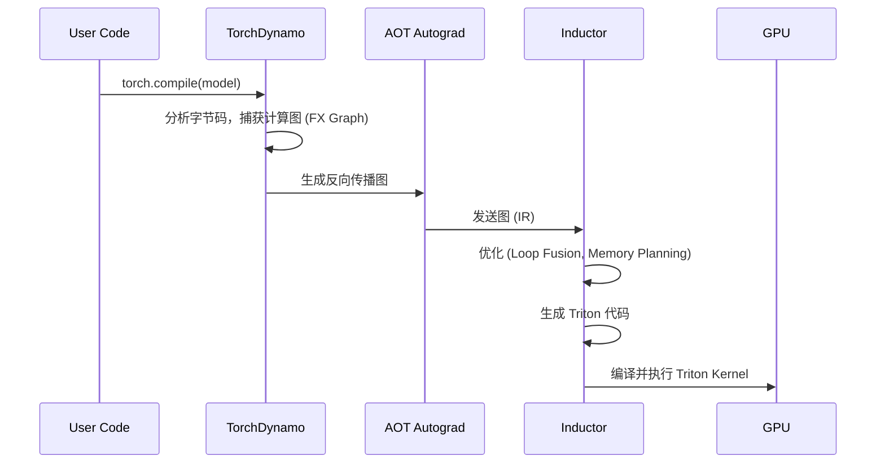

# 第九章：编译器技术 —— 让 Python 跑得像 C++ 一样快 (Compiler Technologies)

在前面的章节中，我们了解到 Python 是一种**解释型语言**，而 GPU 需要的是高度优化的**机器码**。这两者之间存在巨大的鸿沟。

*   **Python 的视角**：灵活、动态、易于编写（数学公式直译）。
*   **GPU 的视角**：需要精确的内存管理、并行调度、指令流水线。

在 PyTorch 1.x 时代，为了填补这个鸿沟，工程师们手动编写了大量的 CUDA Kernel（C++ 扩展）。但这带来了两个问题：
1.  **开发效率低**：写 CUDA 就像写汇编，不仅难写，而且难以维护。
2.  **优化难度大**：针对不同的硬件（NVIDIA A100 vs H100），需要不同的优化策略。

**深度学习编译器 (Deep Learning Compilers)** 的出现，彻底改变了这一局面。它们让我们可以用 Python 写数学公式，然后自动生成媲美手写 CUDA 的高性能机器码。

本章我们将深入探讨 **PyTorch 2.0 的核心技术栈**：**TorchDynamo**（图捕获）与 **Triton**（代码生成）。

---

## 9.1 为什么我们需要编译器？ (The Need for Compilation)

### 9.1.1 解释器开销与算子碎片化

在**动态图 (Eager Mode)** 模式下，PyTorch 逐行执行 Python 代码。

```python
import torch

def foo(x, y):
    a = torch.sin(x)  # Kernel 1: Read x -> Compute sin -> Write a
    b = torch.cos(y)  # Kernel 2: Read y -> Compute cos -> Write b
    return a + b      # Kernel 3: Read a, b -> Compute add -> Write result
```

在这个简单的例子中，GPU 启动了 3 个 Kernel。这带来了两个严重的性能杀手：

1.  **Kernel Launch Overhead (启动开销)**：CPU 通知 GPU 启动一个 Kernel 需要时间（几微秒）。如果 Kernel 执行时间很短（比如只是做一个加法），启动开销甚至可能超过计算时间。
2.  **Memory Bandwidth Waste (带宽浪费)**：
    *   `a` 和 `b` 是中间变量，它们被写入显存 (HBM)，然后马上又被读出来计算 `a + b`。
    *   **理想情况**：应该把 `x` 和 `y` 读入寄存器，计算 `sin(x) + cos(y)`，然后直接写回结果。中间结果 `a` 和 `b` 根本不需要离开 GPU 核心（或者只在极快的 SRAM 中暂存）。


---

## 9.2 PyTorch 2.0 Inductor：从动态图到静态图

PyTorch 2.0 引入了 `torch.compile`，其背后是两个关键组件：**TorchDynamo** 和 **TorchInductor**。

### 9.2.1 图捕获 (Graph Capture) —— TorchDynamo

Python 是一门极其动态的语言，这使得获取完整的“计算图”非常困难。TorchDynamo 使用了 **Frame Evaluation API**（PEP 523）来“钩住” Python 的解释器。

*   **工作原理**：它查看 Python 的字节码 (Bytecode)，尝试识别出哪些是 PyTorch 的操作，哪些是纯 Python 代码。
*   **Partial Graph Capture (部分图捕获)**：如果不被支持的 Python 代码（如调用了第三方库），Dynamo 会把图“切断”，退回到 Eager Mode 执行，然后再重新捕获。这保证了兼容性。



### 9.2.2 代码生成 (Code Generation) —— TorchInductor

一旦捕获了计算图，**TorchInductor** 就负责把它翻译成高效的机器码。
*   **对于 CPU**：它生成 C++ 代码（利用 OpenMP 并行）。
*   **对于 GPU**：它生成 **Triton** 代码。

这就是 PyTorch 2.0 的魔法所在：**它把 PyTorch 模型自动变成了 Triton Kernel**。

---

## 9.3 Triton 语言：打破 CUDA 的垄断

在 Triton 出现之前，要写出高性能的 GPU 代码，你必须精通 CUDA。你需要手动管理：
*   线程块 (Thread Blocks) 和 线程网格 (Grids)。
*   共享内存 (Shared Memory) 的分配与同步。
*   寄存器溢出 (Register Spilling)。
*   存储体冲突 (Bank Conflicts)。
*   合并访问 (Coalesced Access)。

这对数学/算法背景的人来说，门槛太高了。

**Triton**（由 OpenAI 开发，现集成在 PyTorch 中）引入了一种新的编程范式：**块级编程 (Block-level Programming)**。

### 9.3.1 块级编程 (Block-level Programming)

*   **CUDA (Thread-level)**：你编写的代码是控制**每一个线程 (Thread)** 做什么。你需要时刻思考：“我是第几个线程？我要处理第几个数据？”
*   **Triton (Block-level)**：你编写的代码是控制**一个数据块 (Block)** 做什么。Triton 编译器会自动帮你处理块内部的线程并行和内存优化。

#### 案例：向量加法 (Vector Add)

假设我们要计算 $Z = X + Y$，其中 $X, Y$ 是长度为 $N$ 的向量。

**Triton 的思维方式**：
1.  把向量切分成很多个**块 (Block)**，比如每块大小 `BLOCK_SIZE = 1024`。
2.  每个程序实例（Program ID, `pid`）负责处理一个块。
3.  在块内部，我们直接对**整个数组**进行操作，就像写 NumPy 一样。

```python
import triton
import triton.language as tl

@triton.jit
def add_kernel(
    x_ptr,  # x 的内存指针
    y_ptr,  # y 的内存指针
    z_ptr,  # z 的内存指针
    n_elements, # 向量总长度
    BLOCK_SIZE: tl.constexpr # 块大小，编译时常量
):
    # 1. 获取当前程序的 ID (类似于 CUDA 的 blockIdx)
    pid = tl.program_id(axis=0)
    
    # 2. 计算当前块需要处理的数据范围
    # 比如 pid=0, BLOCK_SIZE=1024, 则处理 0~1023
    block_start = pid * BLOCK_SIZE
    offsets = block_start + tl.arange(0, BLOCK_SIZE)
    
    # 3. 边界检查掩码 (Mask)
    # 防止处理超过 n_elements 的数据
    mask = offsets < n_elements

    # 4. 加载数据 (Load)
    # Triton 自动处理合并访问 (Coalesced Access)
    x = tl.load(x_ptr + offsets, mask=mask)
    y = tl.load(y_ptr + offsets, mask=mask)

    # 5. 计算 (Compute)
    # 这一行看起来像 Python，但其实是在寄存器中并行的
    output = x + y

    # 6. 写回数据 (Store)
    tl.store(z_ptr + offsets, output, mask=mask)
```

**代码解读**：
*   `tl.arange(0, BLOCK_SIZE)`：这不仅仅生成一个数组，它告诉编译器“我要并行处理这 1024 个数”。
*   `tl.load` / `tl.store`：看似简单的读写，Triton 编译器会在后台自动优化，生成利用 GPU 高带宽的指令（如 `LDG.E.128`）。

### 9.3.2 自动化优化 (Automated Optimization)

Triton 编译器之所以强大，是因为它替你做了最难的“脏活累活”：

1.  **自动合并访问 (Coalesced Access)**：
    *   在 CUDA 中，如果线程读取内存的地址不连续，性能会暴跌。
    *   在 Triton 中，只要你操作的是 Block，编译器会自动安排线程去读取连续的内存地址。

2.  **自动共享内存管理 (Shared Memory Management)**：
    *   在实现矩阵乘法 (MatMul) 或 FlashAttention 时，需要频繁使用 SRAM（共享内存）来复用数据。
    *   手动写 CUDA 需要精确计算 Shared Memory 的偏移量，还要处理 **Bank Conflict**（多个线程同时访问同一个存储体导致的排队）。
    *   Triton 通过分析数据块的访问模式，自动分配 Shared Memory，并插入适当的填充 (Padding) 来消除 Bank Conflict。

3.  **自动流水线 (Pipelining)**：
    *   Triton 可以自动重叠数据的**加载 (Load)** 和 **计算 (Compute)**。当 GPU 在计算当前块时，DMA 引擎已经在后台预取下一个块的数据了。

---

## 9.4 实战：PyTorch 2.0 性能测试

让我们通过一个简单的例子，看看 `torch.compile` 到底能带来多大的提升。我们将模拟一个典型的 Transformer 模块：LayerNorm + Linear + GELU。

```python
import torch
import time

# 定义一个简单的模型层
class MyLayer(torch.nn.Module):
    def __init__(self, in_features, out_features):
        super().__init__()
        self.lin = torch.nn.Linear(in_features, out_features)
        self.ln = torch.nn.LayerNorm(out_features)

    def forward(self, x):
        # 典型的 Transformer 操作序列
        x = self.lin(x)
        x = self.ln(x)
        x = torch.nn.functional.gelu(x)
        return x

# 初始化
device = "cuda"
model = MyLayer(4096, 4096).to(device)
x = torch.randn(32, 4096, device=device) # Batch size 32

# 1. Eager Mode (默认)
# 预热
for _ in range(10): model(x)
torch.cuda.synchronize()

start = time.time()
for _ in range(1000):
    model(x)
torch.cuda.synchronize()
print(f"Eager Mode Time: {time.time() - start:.4f}s")

# 2. Compiled Mode (PyTorch 2.0)
# 这一行代码开启了 Inductor + Triton 的魔法
compiled_model = torch.compile(model)

# 预热 (第一次运行会触发编译，比较慢)
for _ in range(10): compiled_model(x)
torch.cuda.synchronize()

start = time.time()
for _ in range(1000):
    compiled_model(x)
torch.cuda.synchronize()
print(f"Compiled Mode Time: {time.time() - start:.4f}s")
```

**预期结果**：
在现代 GPU（如 A100/H100）上，Compiled Mode 通常能带来 **30% - 200%** 的加速。加速主要来自：
*   **减少了 Python 解释器的循环开销**。
*   **Inductor 生成了融合后的 Triton Kernel**，减少了显存读写次数。

---

## 9.5 总结

编译器技术是连接数学公式与物理硬件的桥梁。

*   **过去 (CUDA)**：为了性能，我们必须成为硬件专家，手动管理每一个字节的流动。
*   **现在 (Triton/Inductor)**：我们通过**块 (Block)** 这一中间抽象，告诉编译器“我要处理这块数据”，编译器负责把它映射到具体的硬件指令上。

对于算法工程师来说，理解编译器不仅能让你写出更快的代码（知道什么操作能被融合），还能让你在遇到性能瓶颈时，有能力深入到底层去查看生成的 Triton 代码，甚至手写 Triton Kernel 来实现定制化的算子（如 FlashAttention）。
