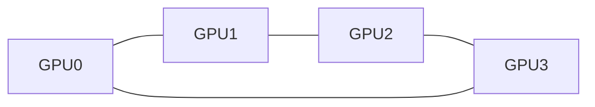
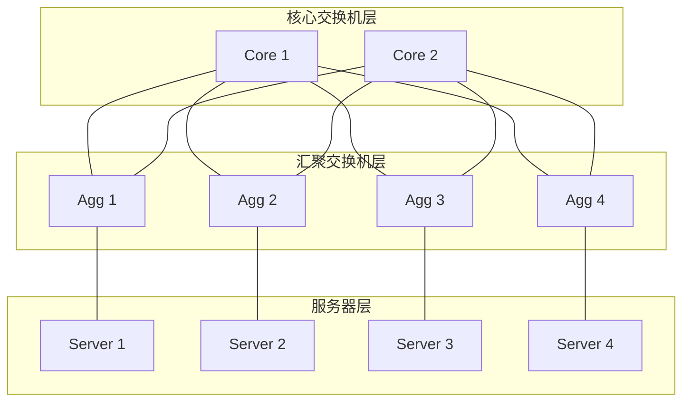
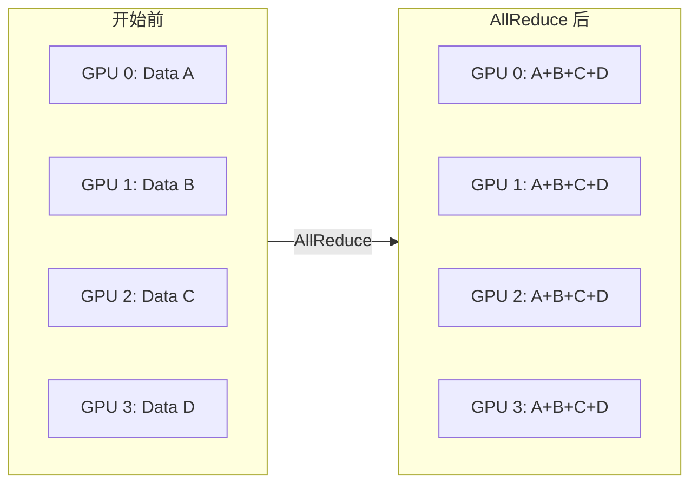
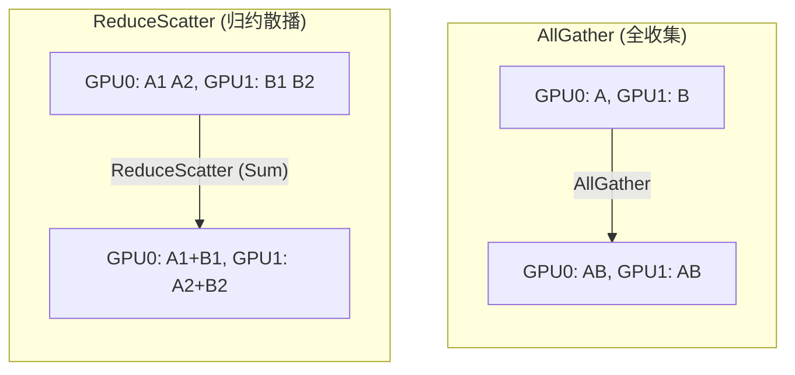

# 第十章：通信的物理限制 —— 分布式训练的血管 (Communication Physics)

在单机时代，我们只关心计算（FLOPS）和显存（Memory）。但在大模型时代，**通信（Communication）** 成为了第三个物理瓶颈。

当你的模型参数分布在 1000 张 GPU 上时，如何让它们像一个整体一样协同工作？这就需要高效的**血管系统**——网络。

本章我们将探讨分布式训练底层的物理限制：带宽、延迟、拓扑结构，以及如何通过数学上的精妙算法（集合通信）来最小化通信代价。

---

## 10.1 网络拓扑与硬件：高速公路的设计艺术

### 10.1.1 带宽 (Bandwidth) vs 延迟 (Latency)

这是通信中最基础的两个物理量，数学背景的同学通常容易混淆。

*   **带宽 (Bandwidth)**：高速公路有多宽（车道数）。单位是 GB/s。
    *   决定了**大**数据传输的快慢（比如传输 1GB 的模型参数）。
*   **延迟 (Latency)**：车速有多快（或者说，过收费站要多久）。单位是 $\mu s$ (微秒)。
    *   决定了**小**数据传输的快慢（比如发送一个“开始”信号）。

> **形象类比**：
> *   **高带宽、高延迟**：用卡车拉满硬盘从北京开到上海。吞吐量极大，但到达需要很久。
> *   **低带宽、低延迟**：发一个光速的 Ping 包。到达极快，但带不了多少货。

在深度学习训练中，我们主要关注**带宽**，因为梯度和参数通常都很大。但在参数服务器 (Parameter Server) 或某些推理解码场景下，延迟也非常关键。

### 10.1.2 RDMA：绕过 CPU 的直通车

传统的 TCP/IP 网络通信是非常“啰嗦”的：
1.  App 把数据拷贝到内核空间。
2.  内核加上 TCP/IP 协议头。
3.  CPU 把数据发给网卡。
4.  对方网卡收到数据，CPU 中断，内核解包，拷贝回用户空间。

这一路上，**CPU 忙得不可开交**，不仅增加了延迟，还抢占了原本用于计算梯度的 CPU 资源。

**RDMA (Remote Direct Memory Access)** 技术的出现解决了这个问题。它允许一张网卡直接去读写另一台机器内存中的数据，**完全不需要 CPU 参与**，也不需要操作系统内核介入（Zero-copy）。

*   **Ethernet (以太网)**：通常用于管理和低速通信。
*   **InfiniBand (IB)**：专为高性能计算设计的网络协议，原生支持 RDMA，带宽极高（如 NVIDIA Quantum-2, 400Gb/s）。

### 10.1.3 网络拓扑 (Network Topologies)

有了网线，怎么把成千上万个 GPU 连起来？不同的连接方式（拓扑）决定了通信的效率。

#### 1. Ring (环形)
这是单机多卡（如一台服务器内 4 张 GPU）最常见的拓扑。NVIDIA 的 NVLink 通常在机器内部构建这种高速环路。

*   **优点**：结构简单，利用 Ring 算法可以跑满带宽。
*   **缺点**：如果断了一条线，环就断了（容错差）；跨节点扩展难。

#### 2. Fat-Tree (胖树)
这是数据中心集群（多机互联）的标准拓扑。

*   **特点**：越往上层，带宽越“胖”（交换机越多、性能越强），保证任意两个节点之间的通信带宽都是无阻塞的 (Non-blocking)。
*   **应用**：几乎所有的大规模 AI 集群（如 AWS, Azure, NVIDIA SuperPOD）都采用 Fat-Tree 变种。

---

## 10.2 集合通信原语 (Collective Communication Primitives)

在分布式训练中，我们很少使用点对点 (Point-to-Point) 的 `Send/Recv`，而是使用**集合通信 (Collectives)**。这是指一组进程（GPU）共同参与的通信模式。

PyTorch 的 `torch.distributed` 也就是基于 MPI (Message Passing Interface) 的标准定义了一套原语。

### 10.2.1 AllReduce：数据并行的灵魂

在数据并行 (Data Parallelism) 中，每张卡算出自己的梯度 $g_i$，我们需要算出全局平均梯度 $\bar{g} = \frac{1}{N} \sum g_i$，然后把 $\bar{g}$ 发回给每一张卡，以便更新参数。

这个操作就是 **AllReduce (Sum)**。

### 10.2.2 Ring-AllReduce 算法

直接让所有卡把数据发给 GPU 0，加完再发回来？不行，那样 GPU 0 的带宽会瞬间爆炸。

**Ring-AllReduce** 是百度在 2017 年引入深度学习领域的经典算法，它将带宽利用率做到了极致。它分为两个阶段：

1.  **Scatter-Reduce**：每个 GPU 最终只拥有一部分完整的和。
2.  **AllGather**：每个 GPU 把自己那部分完整的和广播给其他 GPU。

**数学上的带宽分析**：
假设模型大小为 $\Phi$ (字节)，有 $N$ 个 GPU。
使用 Ring 算法，每个 GPU 需要发送的数据量是：
$$ \text{Data Sent} = 2 \cdot \frac{N-1}{N} \cdot \Phi $$

**神奇的结论**：当 $N$ 很大时，$\frac{N-1}{N} \approx 1$。这意味着**通信时间几乎不随 GPU 数量增加而增加**！这就是为什么我们可以线性扩展到成千上万张卡的原因。

### 10.2.3 其他常用原语

在模型并行 (Model Parallelism) 和 ZeRO 优化中，我们还会用到：

*   **Broadcast**：一个人说，所有人听（把参数从 Rank 0 复制到所有卡）。
*   **Reduce**：所有人说话，汇总给一个人（把 Loss 汇总到 Rank 0）。
*   **AllGather**：每个人有一块数据，最后每个人都拥有所有数据。
    *   *用途*：模型并行中，收集各部分的输出。
*   **ReduceScatter**：每个人有一块数据，最后按位置求和，分散在每个人手中。
    *   *用途*：ZeRO 阶段，将梯度在不同卡上求和并分片存储。

### 10.2.4 通信与计算重叠 (Overlapping)

无论网络多快，通信终究是需要时间的。为了极致性能，我们希望**一边计算，一边通信**。

*   **反向传播时**：当我们算完最后一层的梯度，就可以立刻开始做这一层的 AllReduce，同时计算倒数第二层的梯度。
*   **PyTorch DDP**：通过 `Bucket` (桶) 机制实现。它不会等所有梯度都算完才通信，而是攒够几 MB 数据（一个桶）就发出去。

```mermaid
gantt
    title 无重叠 vs 有重叠
    dateFormat s
    axisFormat %S
    
    section 无重叠 (Serial)
    计算梯度 :a1, 0, 3s
    AllReduce :a2, after a1, 2s
    
    section 有重叠 (Overlapped)
    计算梯度 Layer N :b1, 0, 1s
    计算梯度 Layer N-1 :b2, after b1, 1s
    AllReduce Layer N :b3, after b1, 1s
    计算梯度 Layer N-2 :b4, after b2, 1s
    AllReduce Layer N-1 :b5, after b2, 1s
```

## 10.3 总结

*   **物理层**：RDMA 和 InfiniBand 提供了高带宽、低延迟的物理通道，绕过了 CPU 瓶颈。
*   **拓扑层**：Fat-Tree 保证了大规模集群的连通性，Ring 结构在单机内部效率极高。
*   **算法层**：Ring-AllReduce 等集合通信算法，通过巧妙的数据切分，让通信时间与节点数量几乎解耦。

理解这些，你就会明白为什么有时候**加卡不一定能加速**（通信占比较大），以及为什么**NVLink** 这种昂贵的互联技术卖得那么贵。
