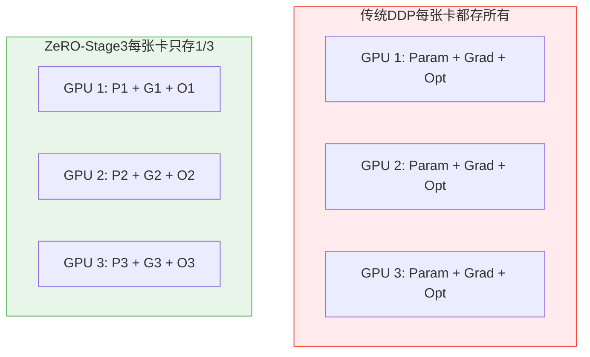
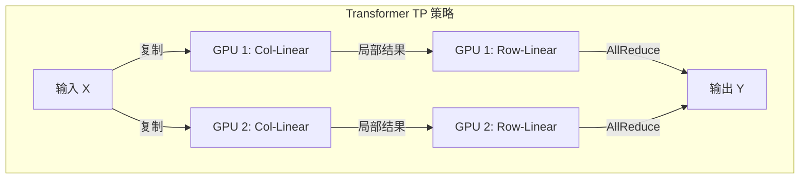

# 第十一章：并行策略的数学描述 (Parallelism Strategies)

如果模型能塞进一张显卡，世界是美好的。但当模型参数量突破 100B（1000亿），连 A100 80GB 也只能装下它的“冰山一角”。

这时候，我们必须把模型**切分**。

切分的方式有无数种，但主流的策略只有三种，它们分别对应数学上的不同维度：
1.  **数据并行 (Data Parallelism, DP)**：切分数据（Batch 维度）。
2.  **模型并行 (Tensor Parallelism, TP)**：切分矩阵（Hidden 维度）。
3.  **流水线并行 (Pipeline Parallelism, PP)**：切分层（Layer 维度）。

本章我们将用最直观的图解和简单的数学公式，剖析这三种策略的原理与代价。

---

## 11.1 数据并行 (Data Parallelism, DP)

这是最简单、最常用的并行方式。

### 11.1.1 核心思想
**“一人一份模型，大家分头算数据，最后对答案。”**

*   **模型**：复制 $N$ 份，每张卡一份。
*   **数据**：把一个大 Batch 切分成 $N$ 个小 Batch。
*   **同步**：反向传播结束后，所有卡进行 `AllReduce(Gradients)`，确保大家的梯度一致，从而更新出相同的参数。

### 11.1.2 显存瓶颈与 ZeRO 优化
在传统的 DDP (Distributed Data Parallel) 中，每张卡都存了**完整**的模型状态：
1.  **参数 (Parameters)**: FP16
2.  **梯度 (Gradients)**: FP16
3.  **优化器状态 (Optimizer States)**: FP32 (Adam 需要存 Momentum 和 Variance)

对于一个 $\Phi$ 参数量的模型，显存占用约为 $2\Phi + 2\Phi + 12\Phi = 16\Phi$。
如果是 175B 的 GPT-3，仅存储就需要 $175 \times 10^9 \times 16 \text{ Bytes} \approx 2.8 \text{ TB}$ 显存！任何单卡都存不下。

**ZeRO (Zero Redundancy Optimizer)** 的出现打破了这一僵局。它的核心思想是：**既然大家都在算一样的东西，为什么要重复存储？**

*   **ZeRO-1**：切分优化器状态。显存降为 $4\Phi$。
*   **ZeRO-2**：切分梯度。显存降为 $2\Phi$。
*   **ZeRO-3**：切分参数。显存降为 $\frac{16\Phi}{N}$。

当 $N$ 足够大时，单卡显存占用几乎可以忽略不计！



---

### 11.1.3 补充概念：Batch, Micro-Batch 与梯度累积 (Gradient Accumulation)

在分布式训练中，有三个关于 "Batch" 的概念容易混淆，必须厘清：

1.  **Global Batch Size**: 全局一次更新参数所用的样本总数。
    *   *决定了收敛速度和精度*。
2.  **Micro-Batch Size**: 每张卡每次前向/反向传播实际计算的样本数。
    *   *决定了单卡显存占用*。
3.  **Gradient Accumulation Steps**: 梯度累积步数。

**公式关系**：
$$ \text{Global Batch Size} = \text{Micro-Batch Size} \times \text{Data Parallel Size (GPU数量)} \times \text{Gradient Accumulation Steps} $$

**为什么需要梯度累积？**
假设你想用 `Batch Size = 1024` 训练，但你的 GPU 显存太小，一次只能塞进 `32` 个样本。怎么办？
*   **方法**：你不必每算完 32 个样本就更新一次参数。你可以算完 32 个，把梯度**存起来（累加）**，再算下 32 个... 循环 32 次后，你实际上就攒够了 1024 个样本的梯度。这时再调用 `optimizer.step()` 更新参数。
*   **代价**：显存占用是小的 (Micro-Batch)，但训练效果等价于大的 (Global Batch Size)。

```python
# 梯度累积伪代码
optimizer.zero_grad()

for i, (inputs, labels) in enumerate(dataloader):
    outputs = model(inputs)
    loss = criterion(outputs, labels)
    
    # 关键：Loss 要除以累积步数，保证梯度幅度和大 Batch 一致
    loss = loss / accumulation_steps 
    loss.backward() # 梯度累加，而不是覆盖
    
    if (i + 1) % accumulation_steps == 0:
        optimizer.step() # 更新参数
        optimizer.zero_grad() # 清空累积的梯度
```

---

## 11.2 模型并行 (Tensor Parallelism, TP)

当单卡连**一层**网络都算不过来时（比如超大的矩阵乘法），我们需要把矩阵切开。

### 11.2.1 矩阵乘法的切分
假设我们要计算 $Y = X \cdot A$，其中 $X$ 是输入，$A$ 是权重矩阵。

#### 1. 列切分 (Column Parallelism)
把权重 $A$ 按**列**切成两半 $A_1, A_2$。
$$ X \cdot [A_1, A_2] = [X \cdot A_1, X \cdot A_2] = [Y_1, Y_2] $$
*   GPU 1 计算 $Y_1 = X \cdot A_1$
*   GPU 2 计算 $Y_2 = X \cdot A_2$
*   最后通过 `AllGather` 把 $Y_1, Y_2$ 拼起来得到 $Y$。

#### 2. 行切分 (Row Parallelism)
把权重 $A$ 按**行**切成两半 $A_1, A_2$，同时把输入 $X$ 按**列**切成 $X_1, X_2$。
$$ X \cdot A = [X_1, X_2] \cdot \begin{bmatrix} A_1 \\ A_2 \end{bmatrix} = X_1 A_1 + X_2 A_2 = Y_1 + Y_2 $$
*   GPU 1 计算 $Y_1 = X_1 \cdot A_1$
*   GPU 2 计算 $Y_2 = X_2 \cdot A_2$
*   最后通过 `AllReduce(Sum)` 把 $Y_1, Y_2$ 加起来得到 $Y$。

### 11.2.2 Transformer 中的 TP
Megatron-LM 巧妙地结合了这两种切分，使得 Transformer Block 内部的通信最小化。

1.  **MLP 层**：先做列切分（扩维），再做行切分（降维）。中间不需要通信！
2.  **Self-Attention 层**：多头注意力天生就是并行的。每个 GPU 负责一部分 Head。



---

## 11.3 流水线并行 (Pipeline Parallelism, PP)

如果把模型看作一个有 100 层的蛋糕，PP 就是**把蛋糕横切**，每人分几层。

*   GPU 1: Layer 1-10
*   GPU 2: Layer 11-20
*   ...

### 11.3.1 朴素 PP 的问题：气泡 (Bubble)
如果直接按顺序做：GPU 1 算完发给 GPU 2，GPU 2 算完发给 GPU 3...
你会发现，**大部分时间 GPU 都在排队等待**。这种空闲时间称为“气泡”。

### 11.3.2 1F1B 策略 (One-Forward-One-Backward)
为了填补气泡，我们将一个 Batch 拆分成更小的 **Micro-Batch**。
GPU 不再傻等整个 Batch 算完，而是算完一个 Micro-Batch 就赶紧发给下一个人，然后转头处理下一个 Micro-Batch。

这样，流水线就被“填满”了。

```mermaid
gantt
    title 流水线并行 (4个 Micro-Batch, 2个 GPU)
    dateFormat s
    axisFormat %S
    
    section GPU 1
    F1 :a1, 0, 1s
    F2 :a2, after a1, 1s
    F3 :a3, after a2, 1s
    F4 :a4, after a3, 1s
    B1 :b1, after a4, 1s
    B2 :b2, after b1, 1s
    B3 :b3, after b2, 1s
    B4 :b4, after b3, 1s
    
    section GPU 2
    Wait :done, 0, 1s
    F1 :c1, after a1, 1s
    F2 :c2, after c1, 1s
    F3 :c3, after c2, 1s
    F4 :c4, after c3, 1s
    B1 :d1, after c4, 1s
    B2 :d2, after d1, 1s
    B3 :d3, after d2, 1s
    B4 :d4, after d3, 1s
```



*   **F**: Forward (前向)
*   **B**: Backward (反向)
*   可以看到，除了开头和结尾有一点空闲，中间部分两个 GPU 都在忙碌。

---

## 11.4 总结：如何选择策略？

| 策略 | 切分维度 | 优点 | 缺点 | 通信量 | 典型应用 |
| :--- | :--- | :--- | :--- | :--- | :--- |
| **Data Parallel (DP/ZeRO)** | Batch | 实现简单，扩展性好 | 单卡显存限制 (ZeRO 可解) | 低 (只传梯度) | BERT, ResNet, 这里的 ZeRO-3 可训千亿模型 |
| **Tensor Parallel (TP)** | Hidden | 减少单层计算延迟 | 通信极频繁，需 NVLink | 极高 (每层都要 AllReduce) | GPT-3, Megatron-LM |
| **Pipeline Parallel (PP)** | Layer | 显存占用最均衡 | 存在气泡，实现复杂 | 低 (只传边界激活值) | 超深模型, 跨机训练 |

**终极大法：3D 并行**
对于万亿参数的巨型模型，我们通常同时使用这三种策略：
*   在机器**内部**使用 TP（利用 NVLink 高带宽）。
*   在机器**之间**使用 PP（跨机带宽较小）。
*   在整体**外层**使用 DP（增加 Batch Size 加速收敛）。
