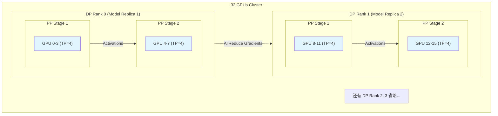

# 第十二章：大模型训练实战 (LLM Training Practice)

理论上我们已经掌握了 DP、TP、PP 三种武器，但在真实的战场上（千亿参数模型训练），单独使用任何一种都无法赢得胜利。

我们需要将它们组合起来，形成 **3D 并行 (3D Parallelism)**。

此外，大模型训练中最让人头秃的不是慢，而是 **不稳定**（Loss 突然飞升或变成 NaN）。本章将分享实战中的生存指南。

---

## 12.1 3D 并行混合：排兵布阵的艺术

想象你有一个由 1000 张 A100 组成的集群。如何分配这些 GPU？

我们将并行策略像洋葱一样一层层包裹起来，原则是：**通信量越大的策略，越要放在高带宽的连接里**。

### 12.1.1 洋葱模型

1.  **最内层：模型并行 (TP)**
    *   **通信量**：极高（每层都要 AllReduce）。
    *   **位置**：必须限制在**单机内部**（利用 NVLink 600GB/s 带宽）。
    *   **规模**：通常是 2, 4, 8（一张节点内的卡数）。

2.  **中间层：流水线并行 (PP)**
    *   **通信量**：较低（只传边界的 Activation）。
    *   **位置**：跨机连接（InfiniBand 200Gbps）。
    *   **规模**：取决于模型层数和显存限制。

3.  **最外层：数据并行 (DP/ZeRO)**
    *   **通信量**：中等（传梯度）。
    *   **位置**：跨越所有剩余的维度。
    *   **作用**：增加 Batch Size，加速收敛。

### 12.1.2 3D 并行拓扑图

假设我们有 4 台机器，每台 8 张卡（共 32 卡）。
*   **TP=4**: 每台机器内，每 4 张卡组成一个 TP 组（一台机器有 2 个 TP 组）。
*   **PP=2**: 两个 TP 组串联起来，组成一个完整的模型副本。
*   **DP=4**: 整个集群有 4 个这样的模型副本在并行跑数据。



### 12.1.3 如何选择参数？

| 模型规模 | 显存需求 (FP16) | 推荐策略 | 理由 |
| :--- | :--- | :--- | :--- |
| **< 10B** | < 20GB | **ZeRO-3** | 单卡放得下，ZeRO-3 简单且显存够用。 |
| **10B - 100B** | 20GB - 200GB | **TP + ZeRO** | 单卡放不下，单机能放下。TP=8, DP=N。 |
| **> 100B** | > 200GB | **TP + PP + ZeRO** | 单机都放不下，必须跨机 PP。 |

---

## 12.2 混合精度训练稳定性：与 NaN 的战争

当你看到 Loss 变成 `NaN` (Not a Number) 时，心跳通常会漏一拍。

### 12.2.1 为什么会 NaN？

在 FP16（半精度）下，能表示的最大数只有 $65504$。
*   **上溢出 (Overflow)**：梯度 $> 65504 \rightarrow \infty$。
*   **下溢出 (Underflow)**：梯度 $< 2^{-14} \rightarrow 0$。

### 12.2.2 梯度裁剪 (Gradient Clipping)

防止梯度爆炸的最有效手段。无论梯度多大，强行把它按比例缩小，使其范数（Norm）不超过某个阈值（如 1.0）。

$$ \text{if } \|g\| > \text{threshold}, \quad g \leftarrow g \times \frac{\text{threshold}}{\|g\|} $$

```python
# PyTorch 实现
scaler = torch.cuda.amp.GradScaler() # 混合精度缩放器

# 前向 + 反向
with torch.cuda.amp.autocast():
    loss = model(input)
scaler.scale(loss).backward()

# 先 Unscale 梯度，以便进行裁剪
scaler.unscale_(optimizer)

# 梯度裁剪：把所有梯度的 Norm 限制在 max_norm 以内
torch.nn.utils.clip_grad_norm_(model.parameters(), max_norm=1.0)

# 更新参数
scaler.step(optimizer)
scaler.update()
```

### 12.2.3 调试技巧

1.  **观察 Loss Scale**：如果 `scaler.get_scale()` 一直在变小，说明梯度一直在溢出。
2.  **定位层**：注册 Hook 打印每层的梯度 Norm，看是哪一层炸了（通常是 Embedding 或最后的 Linear）。
3.  **换 BF16**：如果硬件支持（A100/H100/3090+），**无脑切 BF16**。BF16 的范围和 FP32 一样大，几乎不会溢出，不需要 Loss Scaler。

---

## 12.3 长序列训练：序列并行 (Sequence Parallelism)

当 Context Length 从 4k 增加到 32k、100k 甚至 1M 时，显存并不是线性增长，而是**平方级爆炸**（Attention Matrix 是 $N \times N$）。

即使使用了 FlashAttention，中间的激活值（Activations）依然巨大。

### 12.3.1 核心思想
**TP (Tensor Parallel)** 切的是 Hidden Size 维度。
**SP (Sequence Parallel)** 切的是 Sequence Length 维度。

在 LayerNorm 和 Dropout 处，TP 通常需要 AllReduce，这里是重复计算的。SP 的做法是：
**既然大家都要算，不如把序列切开，每人算一段，最后 AllGather 拼起来。**

### 12.3.2 Ring Attention
对于百万级超长序列，甚至 SP 都不够用。
**Ring Attention** 将 Attention 计算拆分成环状通信。
*   GPU 1 存 Key/Value 的第 1 块。
*   GPU 2 存 Key/Value 的第 2 块。
*   Query 在 GPU 间传递，计算完一部分 Attention Score 就传给下一个人。

**结论**：想训长文本？请确保你的集群支持 FlashAttention-2 和 Sequence Parallelism。
