# 第十三章：Linux 环境与高性能运维 (Linux & DevOps)

对于习惯了 Windows/Mac 图形界面的统计学同学来说，Linux 的黑框终端（Terminal）简直是噩梦。

但**服务器的世界是 Linux 的**。

无论是在学校的超算集群，还是在科技公司的 GPU 云，你都必须通过 SSH 连接到一个黑框里工作。与其恐惧它，不如把它变成你的**第二大脑**。

本章不讲枯燥的系统管理，只讲**算法工程师每天必须用到的生存技能**：如何用一行命令处理百万行日志？如何一眼看穿代码慢在哪里？如何向集群提交任务？

---

## 13.1 Shell 编程与自动化：你的瑞士军刀

在 Linux 中，**一切皆文件，一切皆文本**。训练日志是文本，配置文件是文本，代码也是文本。

掌握文本处理工具，你就不需要写 Python 脚本来做简单的清洗工作。

### 13.1.1 日志分析三剑客：grep, awk, sed

假设你的训练日志 `train.log` 长这样：
```text
[2023-10-01 10:00:01] Epoch 1, Step 100, Loss: 2.345, LR: 0.001
[2023-10-01 10:00:02] Epoch 1, Step 200, Loss: 2.123, LR: 0.001
[ERROR] CUDA out of memory
[2023-10-01 10:00:03] Epoch 1, Step 300, Loss: 1.987, LR: 0.001
```

#### 1. grep: 过滤器 (Filter)
**场景**：我想看所有的 Error，或者只想看 Loss。

```bash
# 只看包含 "Loss" 的行
grep "Loss" train.log

# 只看包含 "ERROR" 的行，并显示前后 2 行上下文 (-C 2)
grep -C 2 "ERROR" train.log
```

#### 2. awk: 列处理器 (Column Selector)
**场景**：我想把 Loss 的值提取出来，画个图，或者算个平均值。
`awk` 就像一个命令行的 Excel。默认按空格分列。

```bash
# 提取第 7 列 (Loss: 后面那个数？不对，按空格分)
# [2023..] Epoch 1, Step 100, Loss: 2.345, LR: 0.001
# $1       $2    $3 $4   $5   $6    $7     $8  $9

# 提取 Loss 值 (去掉逗号可能需要处理，这里简单演示)
grep "Loss" train.log | awk '{print $7}' 
# 输出:
# 2.345,
# 2.123,
# 1.987,
```

#### 3. sed: 替换器 (Stream Editor)
**场景**：我想批量修改配置文件，或者去掉上面输出的逗号。

```bash
# 把所有的逗号替换为空
grep "Loss" train.log | awk '{print $7}' | sed 's/,//g'
# 输出:
# 2.345
# 2.123
# 1.987
```

**组合技：计算平均 Loss**
```bash
grep "Loss" train.log | awk '{print $7}' | sed 's/,//g' | awk '{sum+=$1} END {print sum/NR}'
```
*   这一行命令比写个 Python 脚本快多了！

### 13.1.2 任务调度：Slurm 集群基础

在学校或公司，GPU 是公共资源。你不能直接 SSH 上去就跑，你得**排队**。
Slurm 是最常用的调度系统。

**核心概念**：
*   **Partition (分区)**：类似银行的 VIP 窗口和普通窗口。有的分区有 A100，有的只有 3090。
*   **Job (作业)**：你提交的一段脚本。

**常用命令**：

| 命令 | 作用 | 类比 |
| :--- | :--- | :--- |
| `sbatch run.sh` | 提交后台作业 | 投递作业到老师办公室 |
| `srun --pty bash` | 申请一个交互式终端 | 申请一间自习室自己用 |
| `squeue -u me` | 查看我的排队情况 | 看还有几个人排在前面 |
| `scancel 12345` | 取消作业 | 撤回作业 |
| `sinfo` | 查看节点状态 | 看哪些自习室是空的 |

**典型的脚本 (run.sh)**：
```bash
#!/bin/bash
#SBATCH --job-name=my_gpt        #以此命名作业
#SBATCH --partition=gpu_a100     # 指定分区
#SBATCH --nodes=1                # 需要几个节点
#SBATCH --gres=gpu:1             # 每个节点需要几张卡
#SBATCH --time=24:00:00          # 预计跑多久
#SBATCH --output=logs/%j.out     # 标准输出日志

module load cuda/11.8
source activate my_env

python train.py --batch_size 32
```

---

## 13.2 性能分析工具 (Profiling)：代码的体检仪

代码跑得慢，不要瞎猜。用数据说话。

### 13.2.1 系统级监控 (System Monitoring)

当你发现训练速度变慢，先看系统资源。

1.  **htop (CPU & 内存)**
    *   **绿条 (CPU)**：如果 CPU 满了但 GPU 没满，说明 **Data Loader 卡住了**（数据预处理太慢）。
    *   **内存 (Mem)**：如果 Swap 飙升，说明内存爆了，系统在频繁读写硬盘，速度会极其缓慢。

2.  **nvtop (GPU 专用)**
    *   **最直观的 GPU 监控**。
    *   可以看到每张卡的：利用率 (GPU%)、显存占用 (MEM%)、温度、功耗。
    *   **关键指标**：如果 GPU% 忽高忽低（锯齿状），说明 GPU 在等 CPU 喂数据（IO 瓶颈）。理想情况是由于 GPU% 一直维持在 95% 以上。

3.  **dstat (磁盘与网络)**
    *   `dstat -cdngy`
    *   查看磁盘读写速度（Disk I/O）和网络带宽（Net）。
    *   如果是分布式训练，Net 应该很高。如果是本地读取大量小图片，Disk Read 应该很高。

### 13.2.2 代码级分析 (Code Profiling)

如果系统资源没满，但代码就是慢，说明代码逻辑有问题。

1.  **cProfile (Python 内置)**
    *   **原理**：统计每个函数被调用了多少次，花了多少时间。
    *   **用法**：`python -m cProfile -s cumtime train.py`

2.  **py-spy (非侵入式采样)**
    *   **神器**。它可以在代码运行时，像间谍一样“偷看”程序在干嘛，生成火焰图 (Flame Graph)。
    *   **用法**：`py-spy record -o profile.svg --pid 12345`
    *   **火焰图怎么看？**：找最**宽**的那个条，那就是耗时最长的函数。

3.  **Line Profiler (逐行分析)**
    *   想知道具体哪**一**行代码慢？
    *   给函数加上 `@profile` 装饰器。
    *   输出结果会告诉你：第 50 行 `a = b @ c` 占用了 80% 的时间。

### 13.2.3 GPU 级分析 (Trace Analysis)

**PyTorch Profiler + TensorBoard**

这是最专业的分析方式。它能记录下 CPU 发出的每一个指令，和 GPU 执行的每一个 Kernel 的时间轴。

```python
with torch.profiler.profile(
    activities=[torch.profiler.ProfilerActivity.CPU, torch.profiler.ProfilerActivity.CUDA],
    schedule=torch.profiler.schedule(wait=1, warmup=1, active=3, repeat=2),
    on_trace_ready=torch.profiler.tensorboard_trace_handler('./log/profiler'),
    record_shapes=True,
    with_stack=True
) as p:
    for step, batch in enumerate(dataloader):
        train_step(batch)
        p.step()
```

在 TensorBoard 的 **Trace View** 中，你可以看到：
*   **CPU (Python 线程)** 在哪里忙碌。
*   **GPU Stream** 上 Kernel 是如何排列的。
*   **空隙 (Gap)**：CPU 和 GPU 之间的空隙就是你可以优化的地方。

```mermaid
gantt
    title 理想的 GPU 流水线 (CPU 预取与 GPU 计算重叠)
    dateFormat s
    axisFormat %S
    
    section CPU
    Prepare Batch 1 :a1, 0, 1s
    Prepare Batch 2 :a2, after a1, 1s
    Prepare Batch 3 :a3, after a2, 1s
    
    section GPU
    Compute Batch 0 :b1, 0, 1s
    Compute Batch 1 :b2, after a1, 1s
    Compute Batch 2 :b3, after b2, 1s
```



如果你的 Trace 图里，CPU 准备完，GPU 才开始动，那就是**串行**（慢）。我们要追求的是**并行**（Pipeline）。

---

## 13.3 总结

*   **Shell** 是你的手脚，**grep/awk** 是你的眼睛。
*   **Slurm** 是排队系统，遵守规则才能有卡用。
*   **htop/nvtop** 是体温计，**Profiler** 是 CT 扫描。
*   **不要瞎优化**。先 Profile，找到瓶颈（Bottleneck），再动手。
